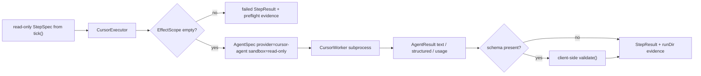

# feat: Wire Cursor Executor, Then Stage Claude and Pi

## Overview

This plan turns Candidate A into an ordered provider rollout. The active implementation scope is **Step 6A: Cursor Agent first**. Claude and Pi remain in the plan as explicit follow-up gates, in the requested order, but should not be merged ahead of Cursor or smuggled into the same acceptance boundary.

The core constraint is unchanged: provider breadth must prove that the `Executor` seam is fungible without changing the kernel. Loops stay data, steps stay typed, policy stays pure, and provider quirks stay inside executor/worker adapters.

## Problem Frame

Looper currently proves the executor seam mostly through Codex-backed runs. `HANDOFF.md` identifies provider breadth as the next "agents of any kind" win, and the user selected the sequence: `cursor-agent`, then `claude-code`, then `pi`.

The hard part is not adding process wrappers. It is preserving looper's safety and evidence model across providers with weaker or different sandbox semantics. Cursor is a headless CLI with useful stream/text/json output but no Codex-style OS sandbox. Claude has an Agent SDK and permission hooks, but its vendored worker is permission-gated rather than hard-confined. Pi's vendored worker currently requires `danger-full-access`, which is incompatible with normal looper execution.

## Requirements Trace

- R1. Land Cursor Agent first as a provider behind the worker/executor seam.
- R2. Keep Cursor v1 fail-closed for write scopes: no `--force` or workspace-write behavior by default.
- R3. Preserve kernel generality: no provider-specific branches in `src/kernel/`, `src/engine/`, or loop policy.
- R4. Keep deterministic, auth-free tests as the release gate; live provider runs are optional gated demos.
- R5. Preserve evidence: provider preflight failures and unsupported sandbox failures must produce evidence under `StepSpec.runDir`.
- R6. Validate structured output client-side before returning `AgentResult.structured`, even when a provider claims native validation.
- R7. Stage Claude second behind an SDK/dependency compatibility gate.
- R8. Stage Pi third as guarded wiring only; no default live Pi path and no accidental `danger-full-access`.
- R9. Do not wire `opencode` in this step.

## Scope Boundaries

- No changes to `Executor`, `Loop`, `Step`, policy, ledger, resume, or tick semantics.
- No `looper --provider`, no public CLI provider-selection UX, no provider-specific registry variants, and no out-of-tree registration work.
- No `src/cli/main.ts` or `src/cli/registry.ts` changes unless a later implementation discovers an unavoidable compile-time issue; live proof should use a gated test or private runner only.
- No shared `src/executors/agent.ts` refactor before Cursor lands. Cursor should initially copy the established Codex/Judge shape; extract a helper only after Cursor proves real duplication.
- No Cursor workspace-write support in Step 6A. A non-empty `EffectScope` should fail closed before spawning Cursor.
- No Pi live execution or unsafe environment flag in this plan. Pi live work requires a separate sandbox/hardening task.

### Deferred to Separate Tasks

- Claude executor merge after Cursor acceptance and SDK compatibility resolution.
- Pi executor merge after Claude acceptance and an explicit sandbox decision.
- Cursor workspace-write support after a separate provider-sandbox task verifies permission/config behavior or adds an external sandbox wrapper.
- `opencode` provider support.
- Candidate B promotion lifecycle and Candidate C out-of-tree loop registration.

## Context & Research

### Relevant Code and Patterns

- `src/kernel/types.ts` defines `Executor`, `StepSpec`, `StepResult`, `EffectScope`, `RunContext`, and the five-slot `Loop`; these should remain provider-agnostic.
- `src/executors/codex.ts` is the pattern to copy for Cursor: prompt precondition, sandbox derivation, composed abort signals, progress capture, `AgentError`/`AgentInterrupted` mapping, evidence under `runDir`, and shutdown delegation.
- `src/executors/judge.ts` shows a second worker-backed executor with intentionally different invariants: structured-output precondition, read-only pinning, and verdict evidence.
- `src/executors/vendor/omegacode/types.ts` defines `ProviderId`, `AgentSpec`, `Sandbox`, `AgentResult`, and `AgentUsage`; Cursor extends this worker-facing contract.
- `src/executors/vendor/omegacode/factory.ts` currently supports `codex` and `fake`; `claude-code`, `opencode`, and `pi` return not implemented.
- `src/executors/vendor/omegacode/subprocess-jsonl.ts` is the subprocess helper to reuse for Cursor-style NDJSON.
- `src/executors/vendor/omegacode/schema.ts` already provides schema compilation, validation, loose JSON parsing, and optional-null normalization helpers.
- `src/executors/vendor/omegacode/claude.ts` is vendored but excluded from `tsconfig.json`; it also permits `danger-full-access` if handed that sandbox, so the future `ClaudeExecutor` must never derive that mode from normal looper scopes.
- `src/executors/vendor/omegacode/pi.ts` compiles but rejects `read-only` and `workspace-write`; it only accepts `danger-full-access`.
- `test/codex-executor.test.ts`, `test/judge-executor.test.ts`, `test/cli.test.ts`, and existing live tests show the local testing style: deterministic default suite, live tests gated by environment.

### Institutional Learnings

- No `docs/solutions/` directory exists in this repo, so there were no local solution writeups or critical patterns to carry forward.

### External References

- Cursor CLI docs show headless print mode (`-p`, `--print`), `--force` for applying changes, and `CURSOR_API_KEY` support for scripts.
- Cursor output docs show `--output-format` values: `json`, `stream-json`, and `text`. `stream-json` emits NDJSON events and a terminal result event.
- Cursor configuration docs show `cli-config.json` and `CURSOR_CONFIG_DIR`, which should be used for per-run Cursor config isolation.
- Claude Agent SDK docs show `@anthropic-ai/claude-agent-sdk`, TypeScript support, bundled native binary, and SDK auth requirements.
- Claude structured-output docs show `outputFormat: { type: "json_schema", schema }`, but looper should still validate structured output locally.
- Claude permissions docs show permission modes and `canUseTool`, but this is permission gating, not OS confinement.

## Key Technical Decisions

- **Active scope is Cursor-only.** The plan records the Claude/Pi sequence, but the first accepted implementation should be Cursor Agent.
- **Cursor write scopes fail closed.** In Step 6A, `CursorExecutor` should run only for `noEffects()`/read-only steps. Any non-empty `EffectScope` returns a failed `StepResult` with a stable unsupported-sandbox code, `retryable: false`, and a preflight evidence artifact under `runDir`. It should not throw for this expected capability failure.
- **Cursor extraction is always read-only.** If Cursor needs a second turn to extract JSON, that turn must omit `--force`, use a read-only/isolated config, and avoid write/tool permissions regardless of the original step.
- **Provider subprocesses use argument arrays, not shell interpolation.** Binary configuration must come from an explicit trusted option or known command name. Tests should prove hostile environment values cannot change the binary in normal runs.
- **Cursor config is isolated by default.** Cursor runs, including live proofs, should use a per-run/scratch `CURSOR_CONFIG_DIR`; using global Cursor config should require an explicit opt-in and should be recorded in evidence.
- **Live proof is optional, not a release gate.** Deterministic tests are the acceptance gate. Live Cursor proof is attempted only when both `LOOPER_LIVE=1` and `LOOPER_LIVE_CURSOR=1` are present; missing auth/binary records a clean skip, not a failed plan.
- **No shared executor helper yet.** Copying the Codex/Judge wrapper shape is safer for Cursor v1. A helper can be planned after Cursor and Claude show the duplication is real.
- **Claude is permission-gated, not hard-confined.** Future Claude work should wire only normal looper read-only behavior first; workspace-write must be scratch/explicit or externally sandboxed until Bash escape checks are proven enough.
- **Pi is guarded only.** Future Pi work may wire the factory and deterministic worker tests, but no normal looper path should emit `danger-full-access`.

## Open Questions

### Resolved During Planning

- Provider order: Cursor Agent first, Claude second, Pi third.
- Step 6A merge scope: Cursor only.
- Opencode scope: excluded.
- CodeGraph setup: initialized for this checkout before planning continued.

### Deferred to Implementation

- Cursor binary name: the user named `cursor-agent`, while current Cursor docs show `agent`. The adapter should default to `cursor-agent` but support an explicit trusted binary option for `agent` or an absolute path.
- Cursor event details: implementation should confirm current local NDJSON field names against official docs and representative local output.
- Claude SDK strategy: after Cursor lands, resolve whether a Zod-3-compatible SDK version exists or whether the repo must migrate from Zod 3 to Zod 4.
- Pi sandbox path: no live Pi work until a separate sandbox wrapper or explicit safety decision exists.

## Output Structure

    docs/
      plans/
        2026-06-10-001-feat-provider-executor-adapters-plan.md
      provider-executors.md
    src/
      executors/
        cursor.ts
        vendor/
          omegacode/
            cursor.ts
            factory.ts
            types.ts
    test/
      cursor-worker.test.ts
      cursor-executor.test.ts
      provider-factory.test.ts
      provider-live.test.ts

Claude and Pi files belong to follow-up steps unless Cursor is already accepted and the implementation explicitly proceeds to the next provider.

## High-Level Technical Design

> *This illustrates the intended approach and is directional guidance for review, not implementation specification. The implementing agent should treat it as context, not code to reproduce.*

Provider capability matrix for this rollout:

| Provider | Status in this plan | Read-only | Workspace-write | Structured output |
|---|---|---|---|---|
| `cursor-agent` | Active Step 6A | Supported via print mode with isolated config | Fails closed in Step 6A | Validated extraction turn if no native schema |
| `claude-code` | Follow-up Step 6B | Future support after SDK gate | Not hard-confined; scratch/external sandbox only | Native SDK path plus local validation |
| `pi` | Follow-up Step 6C | Unsupported by current worker | Unsupported by current worker | Future local validation if wired |

## Phased Delivery

### Step 6A: Cursor Agent

- Land Cursor provider id, worker, executor, deterministic tests, optional live no-effects proof, and provider docs.
- Acceptance order: complete Units 1-4 below before starting Claude.

### Step 6B: Claude Agent SDK

- After Cursor is accepted, resolve SDK/Zod compatibility, activate the vendored Claude worker, and add Claude executor tests.
- This should be its own implementation commit or plan update.

### Step 6C: Pi

- After Claude is accepted, wire Pi only as guarded deterministic support unless a separate sandbox task exists.
- No live Pi path should be part of Step 6A.

## Implementation Units

- [x] **Unit 1: Cursor Worker and Provider Id**

**Goal:** Add `cursor-agent` to the worker-facing provider layer without exposing it through public CLI or registry surfaces.

**Requirements:** R1, R3, R4, R6, R9

**Dependencies:** None

**Files:**
- Create: `src/executors/vendor/omegacode/cursor.ts`
- Modify: `src/executors/vendor/omegacode/types.ts`
- Modify: `src/executors/vendor/omegacode/factory.ts`
- Test: `test/cursor-worker.test.ts`
- Test: `test/provider-factory.test.ts`

**Approach:**
- Add `cursor-agent` to `ProviderId`.
- Implement `CursorWorker` with the existing subprocess helper and injected spawn seam.
- Expand factory options deliberately: Cursor binary/config/spawn seams, while preserving `fake` behavior for every provider and leaving `opencode` intentionally unwired.
- Use `spawn`/argument-array execution through the subprocess helper; do not shell-interpolate prompts, binary names, or flags.
- Parse `stream-json` events into text/tool/progress events and terminal result text. Treat unknown events as forward-compatible noise.
- For schema-bearing turns, perform a read-only extraction turn and validate the parsed value with `schema.validate()` before returning `structured`.
- Build a minimal provider env from an allowlist plus required auth/config variables; avoid inheriting all of `process.env` by default.

**Patterns to follow:**
- `src/executors/vendor/omegacode/pi.ts`
- `src/executors/vendor/omegacode/opencode.ts`
- `src/executors/vendor/omegacode/subprocess-jsonl.ts`
- `src/executors/vendor/omegacode/schema.ts`

**Test scenarios:**
- Happy path: scripted Cursor stream emits assistant messages and a terminal result -> worker returns completed text.
- Happy path: tool call and tool result events -> worker forwards normalized progress events.
- Happy path: schema extraction uses read-only/no-force args, parses JSON, validates it, and returns `structured`.
- Edge case: invalid structured output -> worker rejects with provider error before returning `AgentResult.structured`.
- Edge case: provider-specific factory options are forwarded; `fake` still returns fake workers for every provider.
- Edge case: hostile env/binary values do not change the spawned binary unless explicitly passed as trusted options.
- Error path: binary missing -> non-retryable `binary_not_found`.
- Error path: nonzero exit/no result -> provider failure with stderr tail.
- Error path: abort/stall -> interruption or retryable stall consistent with existing subprocess helpers.
- Integration: `opencode` remains not implemented and existing Codex/Fake factory behavior remains unchanged.

**Verification:**
- Cursor worker behavior is fully testable without auth or network.
- No kernel, engine, CLI, or loop registry files change.

- [x] **Unit 2: Cursor Executor with Fail-Closed Sandbox Policy**

**Goal:** Expose Cursor through looper's `Executor` seam for read-only/no-effects steps while making unsupported write scopes evidence-bearing failures.

**Requirements:** R1, R2, R3, R4, R5, R6

**Dependencies:** Unit 1

**Files:**
- Create: `src/executors/cursor.ts`
- Test: `test/cursor-executor.test.ts`

**Approach:**
- Copy the `CodexExecutor` wrapper pattern rather than extracting a shared helper first.
- Require a rendered prompt, compose timeout with caller abort signal, write prompt/events/final evidence under `runDir`, and map `AgentError`/`AgentInterrupted` into failed/interrupted `StepResult`s.
- For `noEffects()`, construct a read-only Cursor `AgentSpec`.
- For any non-empty `EffectScope`, do not spawn Cursor. Return a failed `StepResult` with a stable code such as `unsupported_sandbox`, `retryable: false`, and a preflight evidence artifact explaining that Cursor workspace-write is not wired in Step 6A.
- Reserve thrown errors for programmer misconfiguration such as missing prompt, not expected provider capability limits.
- Redact auth-looking values and provider config paths from stderr/evidence before writing artifacts.

**Patterns to follow:**
- `src/executors/codex.ts`
- `src/executors/judge.ts`
- `test/codex-executor.test.ts`

**Test scenarios:**
- Happy path: fake Cursor worker text -> completed `StepResult` with text, usage duration, and evidence under `runDir`.
- Happy path: fake Cursor worker structured output -> completed `StepResult` with validated structured output.
- Edge case: retry attempt evidence filenames are stable and prefixed like existing executors.
- Edge case: `noEffects()` produces read-only Cursor spec and never emits force/write flags.
- Error path: non-empty `EffectScope` returns failed preflight result with code, retryability false, and evidence; the worker is not invoked.
- Error path: provider `AgentError` maps to failed `StepResult` with code, retryability, billed usage, and evidence.
- Error path: `AgentInterrupted` or caller abort maps to interrupted `StepResult`.
- Error path: promptless step throws before worker invocation.

**Verification:**
- Cursor executor can run a normal read-only engine step.
- Unsupported Cursor write scope is observable in the ledger as a failed step with evidence, not as an unclassified thrown exception.

- [x] **Unit 3: Cursor Proofs and Live Gate**

**Goal:** Prove Cursor through deterministic tests and an optional live no-effects engine proof without expanding CLI scope.

**Requirements:** R1, R3, R4, R5, R6

**Dependencies:** Units 1-2

**Files:**
- Modify: `package.json` only if a provider-specific live script is useful
- Test: `test/provider-live.test.ts`

**Approach:**
- Add a gated live proof that swaps Cursor into a read-only/no-effects pilot or private test harness. Do not add registered provider-specific loops.
- Gate Cursor live execution with both `LOOPER_LIVE=1` and `LOOPER_LIVE_CURSOR=1`.
- If binary/auth is missing, the live block should skip cleanly and report the skip reason; deterministic tests remain sufficient for normal acceptance.
- Split proof expectations:
  - deterministic worker/executor tests prove parsing, schema extraction, failure mapping, and evidence;
  - optional live proof proves Cursor can complete a no-effects engine tick;
  - workspace-write proof is deferred to the sandbox task.
- Use per-run/scratch `CURSOR_CONFIG_DIR` for live proof and record the config path/effective binary in evidence after redaction.

**Patterns to follow:**
- `test/pilot2.live.test.ts`
- `test/cli.test.ts`

**Test scenarios:**
- Integration: live Cursor block skips unless both `LOOPER_LIVE=1` and `LOOPER_LIVE_CURSOR=1` are present.
- Integration: when enabled and locally authed, Cursor completes a no-effects engine path with normal journal entries.
- Edge case: missing Cursor binary/auth records a clean skip, not a suite failure.
- Edge case: provider-live tests do not run Claude or Pi when only Cursor's gate is set.

**Verification:**
- Default test suite stays auth-free.
- Optional live proof demonstrates step start, provider result, validation, decision, journal, and evidence for Cursor.

- [x] **Unit 4: Cursor Provider Documentation**

**Goal:** Document what Cursor support does and does not promise so future provider work stays honest.

**Requirements:** R2, R3, R4, R5, R9

**Dependencies:** Units 1-3

**Files:**
- Create: `docs/provider-executors.md`

**Approach:**
- Document provider id, binary selection, auth/config expectations, live gates, structured-output strategy, and sandbox status.
- State clearly that Cursor workspace-write is not supported in Step 6A.
- State that `opencode` remains intentionally unwired.
- Include the follow-up order: Claude next, Pi after Claude.

**Patterns to follow:**
- `HANDOFF.md`
- `docs/orchestration-direction.md`

**Test scenarios:**
- Test expectation: none for prose itself.

**Verification:**
- A future implementer can tell which provider modes are safe, unsupported, or deferred.

- [ ] **Unit 5: Claude Follow-Up Gate**

**Goal:** Prepare the next provider step without merging it into Cursor acceptance.

**Requirements:** R7

**Dependencies:** Cursor accepted through Units 1-4

**Files:**
- Future modify: `package.json`
- Future modify: `package-lock.json`
- Future modify: `tsconfig.json`
- Future modify: `src/executors/vendor/omegacode/factory.ts`
- Future create: `src/executors/claude.ts`
- Future test: `test/claude-executor.test.ts`

**Approach:**
- Before adding the SDK, decide the dependency strategy: pin a Zod-3-compatible `@anthropic-ai/claude-agent-sdk` if available, or plan a Zod 3 -> 4 migration and verify schema generation across Pilot 2/3.
- Remove the `claude.ts` TypeScript exclusion only after the dependency strategy is resolved.
- Ensure `ClaudeExecutor` never derives `danger-full-access` from normal looper `EffectScope`.
- Treat Claude workspace-write as permission-gated, not hard-confined; initial proof should be read-only or scratch/external-sandbox only.
- Add local `schema.validate()` before returning `AgentResult.structured`.
- Add tests for Bash escape denial in workspace-like modes, including interpreter commands, `$HOME` expansion, redirects outside cwd, absolute paths, symlinks, and `..`.

**Test scenarios:**
- Happy path: injected query success -> completed result.
- Happy path: schema success -> locally validated structured result.
- Error path: invalid provider structured output -> rejected before `AgentResult.structured`.
- Edge case: normal looper scopes never produce `danger-full-access`.
- Edge case: Bash/path escapes are denied or the mode is marked unsupported.

**Verification:**
- Claude does not begin until Cursor is accepted.
- SDK dependency changes do not silently force schema-library drift.

- [ ] **Unit 6: Pi Follow-Up Gate**

**Goal:** Keep Pi third in the sequence while preventing accidental unsafe execution.

**Requirements:** R8

**Dependencies:** Claude accepted through Unit 5

**Files:**
- Future modify: `src/executors/vendor/omegacode/factory.ts`
- Future create: `src/executors/pi.ts`
- Future test: `test/pi-executor.test.ts`

**Approach:**
- Pi may be wired at the worker/factory level for deterministic tests, but normal executor paths should return a named unsupported failure for `read-only` and `workspace-write`.
- Do not add `LOOPER_LIVE_PI_UNSAFE` or similar in this plan. A live Pi path requires a separate sandbox/hardening task.
- If a future Pi executor exists, unsupported capability failures should be failed `StepResult`s with preflight evidence, not thrown exceptions.
- Add local `schema.validate()` before returning `AgentResult.structured`.

**Test scenarios:**
- Happy path: injected Pi worker can be constructed and tested at the worker layer.
- Error path: normal looper read-only/workspace-write scope returns unsupported preflight failure without spawning.
- Error path: outdated/missing Pi binary maps to non-retryable provider error at worker level.
- Integration: no default registry or live path reaches Pi.

**Verification:**
- Pi remains third and guarded.
- No normal looper path emits `danger-full-access`.

## System-Wide Impact

- **Interaction graph:** private tests/runners construct `CursorExecutor`; `tick()` sees only `Executor.run`; workers call provider subprocesses; results return as `StepResult`.
- **Error propagation:** Expected provider capability failures should return failed `StepResult`s with code, retryability, and evidence. Unexpected worker failures follow existing `AgentError`/`AgentInterrupted` mapping.
- **State lifecycle risks:** Cursor config dirs, evidence artifacts, binary/version metadata, and live-run scratch state must stay per-run or per-test. Global provider config should be opt-in only.
- **API surface parity:** Extending `ProviderId` and `DefaultWorkerFactory` affects worker tests; default CLI and loop registry behavior should remain unchanged.
- **Integration coverage:** Deterministic tests prove parsing, schema validation, sandbox preflight, and evidence; optional live tests prove a real no-effects Cursor tick.
- **Unchanged invariants:** `Executor`, `Loop`, `Step`, `EffectScope`, policy decisions, ledger format, resume behavior, CLI commands, and registry entries stay provider-agnostic and unchanged in Step 6A.

## Risk Analysis & Mitigation

| Risk | Likelihood | Impact | Mitigation |
|------|------------|--------|------------|
| Cursor write mode lacks hard confinement | High | High | Fail closed for non-empty `EffectScope`; defer workspace-write to a sandbox task. |
| Cursor extraction accidentally writes | Medium | High | Extraction turn always read-only/no-force with isolated config; test exact args/config. |
| Provider env leaks credentials into evidence | Medium | High | Use env allowlist, redaction, per-run config dirs, and evidence tests. |
| Cursor binary config becomes arbitrary execution | Medium | High | Use trusted option/known command names, argument-array spawn, version recording, and hostile-env tests. |
| Claude SDK requires Zod 4 | Medium | Medium | Add dependency compatibility gate before un-excluding vendored Claude. |
| Claude workspace-write is overtrusted | Medium | High | Treat as permission-gated only; restrict proof to read-only/scratch/external sandbox. |
| Pi unsafe access sneaks in | Medium | High | No live Pi path in this plan; future Pi returns unsupported preflight failures for normal scopes. |
| Live tests become auth-dependent | High | Medium | Require provider-specific gates; deterministic tests are the release gate. |

## Success Metrics

- Cursor provider id, worker, and executor land without kernel, engine, CLI, or registry changes.
- Cursor default behavior supports read-only/no-effects steps and fails closed for write scopes with evidence.
- Structured output from Cursor is locally validated before it reaches `AgentResult.structured`.
- Default tests remain auth-free.
- Optional Cursor live proof is gated by `LOOPER_LIVE=1` and `LOOPER_LIVE_CURSOR=1`.
- Claude and Pi are documented as ordered follow-ups with explicit gates, not merged into Cursor acceptance.

## Documentation / Operational Notes

- `docs/provider-executors.md` should state:
  - Cursor binary defaults and override policy.
  - Cursor auth/config expectations and `CURSOR_CONFIG_DIR` isolation.
  - Live gate names: `LOOPER_LIVE=1` plus `LOOPER_LIVE_CURSOR=1`.
  - Cursor workspace-write is unsupported in Step 6A.
  - Claude is next but requires SDK/Zod compatibility work.
  - Pi is third and guarded until sandbox support exists.
- Live demos may consume tokens/credits and should not run in normal `npm test`.

## Sources & References

- Origin handoff: `HANDOFF.md`
- Architecture direction: `docs/orchestration-direction.md`
- Executor pattern: `src/executors/codex.ts`
- Judge pattern: `src/executors/judge.ts`
- Worker contracts: `src/executors/vendor/omegacode/types.ts`
- Worker factory: `src/executors/vendor/omegacode/factory.ts`
- Cursor CLI: [https://cursor.com/cli](https://cursor.com/cli)
- Cursor headless CLI: [https://cursor.com/docs/cli/headless](https://cursor.com/docs/cli/headless)
- Cursor output format: [https://cursor.com/docs/cli/reference/output-format](https://cursor.com/docs/cli/reference/output-format)
- Cursor configuration: [https://cursor.com/docs/cli/reference/configuration](https://cursor.com/docs/cli/reference/configuration)
- Claude Agent SDK overview: [https://code.claude.com/docs/en/agent-sdk/overview](https://code.claude.com/docs/en/agent-sdk/overview)
- Claude structured outputs: [https://code.claude.com/docs/en/agent-sdk/structured-outputs](https://code.claude.com/docs/en/agent-sdk/structured-outputs)
- Claude permissions: [https://code.claude.com/docs/en/agent-sdk/permissions](https://code.claude.com/docs/en/agent-sdk/permissions)
