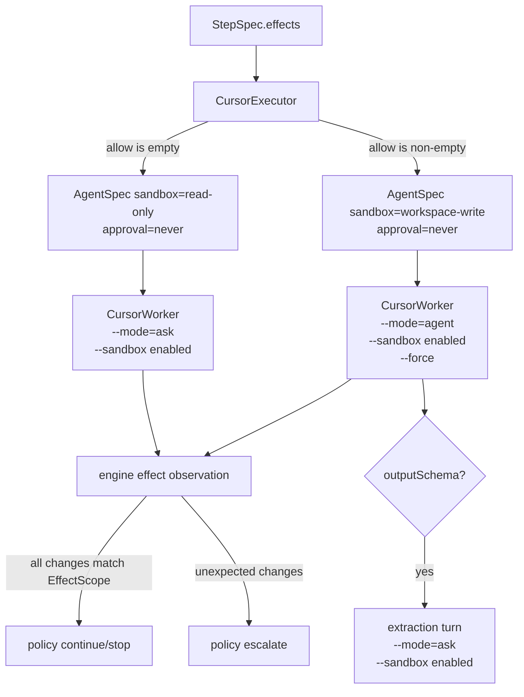

## Summary

Enable `cursor-agent` to run both read-only and write-scoped Vernier steps. Empty `EffectScope` values continue to run as read-only Cursor Ask turns. Non-empty `EffectScope` values run as Cursor Agent turns with Cursor's CLI sandbox enabled, while Vernier keeps exact path/glob enforcement through its existing post-run effects observation and ledger.

The change should keep Vernier's non-interactive contract: provider approval remains `never`, structured-output extraction remains read-only, and out-of-scope writes still escalate through the engine's effect assessment.

Terminology: Vernier's provider/executor id remains `cursor-agent`. The Cursor CLI command is resolved separately from candidate binaries (`agent`, then `cursor-agent`) or an explicit override.

---

## Problem Frame

Vernier currently treats Cursor Agent as read-only by policy:

- `src/executors/cursor.ts` rejects any `spec.effects.allow.length > 0` before spawning Cursor.
- `src/executors/vendor/omegacode/cursor.ts` repeats that safety check and accepts only `sandbox: "read-only"`.
- `docs/provider-executors.md`, `README.md`, and `HANDOFF.md` document Cursor as read-only only.

That was correct for the earlier Step 6A posture, but it now blocks the intended delegation model: Cursor Agent/Composer is a useful write-capable implementation backend, and Vernier already has the right second layer of control in `src/engine/tick.ts`: snapshot, execute, assess changed files against `EffectScope`, journal the observation, then let policy escalate if files changed outside scope.

Official Cursor CLI docs now expose the distinction Vernier needs: Ask mode is read-only, Agent mode can take actions, and the CLI supports `--sandbox enabled`. Vernier should map its existing sandbox vocabulary onto those modes instead of rejecting write-scoped Cursor steps.

---

## Requirements

### Runtime Behavior

- **R1. Executor sandbox derivation**: `CursorExecutor` must remove the write-scope preflight failure and derive `AgentSpec.sandbox` the same way Codex and Claude do: `read-only` for empty effects, `workspace-write` for non-empty effects.
- **R2. Non-interactive approval**: Cursor steps must continue to use `approval: "never"`; Vernier should not add an interactive approval path.
- **R3. Cursor CLI modes**: `CursorWorker` must accept `sandbox: "workspace-write"` and build current Cursor CLI args with `--mode=ask --sandbox enabled` for read-only turns and `--mode=agent --sandbox enabled` for workspace-write turns.
- **R4. Extraction remains read-only**: If a workspace-write Cursor step also requests structured output, the main work turn may run in Agent mode, but the extraction turn must run as `--mode=ask --sandbox enabled`.

### Configuration

- **R5. Binary and model configuration**: Use one shared Cursor binary-resolution rule across worker construction, doctor, and live tests: explicit constructor `bin` wins; `VERNIER_CURSOR_BIN` wins; otherwise probe `agent` first and `cursor-agent` second. Add `VERNIER_CURSOR_MODEL` so `composer-2.5` can be selected without code changes.

### Verification

- **R6. Deterministic coverage**: Tests must cover executor sandbox derivation, worker arg construction for read-only/write/extraction turns, and the engine-level fact that out-of-scope writes still fail through effects observation.
- **R7. Live proof**: Add a gated live write proof behind `VERNIER_LIVE=1 VERNIER_LIVE_CURSOR=1 VERNIER_LIVE_CURSOR_WRITE=1` that uses a scratch git workdir, asks Cursor to write one allowed file, and asserts the Vernier ledger records that changed file with `allowed: true`.
- **R8. Optional negative live proof**: Add a second gated/optional proof that an out-of-scope write escalates via effects. Keep it separate from the normal live write proof so a flaky provider refusal does not obscure the positive proof.

### Documentation

- **R9. Documentation**: Update provider docs and README language from “Cursor read-only only” to “Cursor supports read-only and workspace-write; exact `EffectScope` is enforced by Vernier’s post-run diff, while Cursor’s sandbox provides workspace-level command/file containment.”

---

## High-Level Design



Cursor's sandbox is the provider-level workspace containment layer. Vernier's `EffectScope` remains the exact authorization layer. That means an out-of-scope write can still physically happen inside the workspace, but it is detected after the turn, journaled, and escalated by policy.

---

## Technical Decisions

- **KTD1. Keep Vernier's sandbox vocabulary**: Do not add Cursor-specific step fields. Map `read-only` and `workspace-write` onto Cursor's `--mode` flag inside the worker.
- **KTD2. Reject danger-full-access**: `CursorWorker` should still fail closed for `sandbox: "danger-full-access"` because this feature is only about normal Vernier write scopes.
- **KTD3. Keep approvals disabled**: `approval: "never"` is required for the non-interactive execution contract. Any Cursor behavior that would require prompting should fail provider-side rather than block Vernier.
- **KTD4. Treat structured extraction as a read operation**: Extraction reads the prior text and produces JSON. It should never inherit Agent mode from a write turn.
- **KTD5. Resolve provider id and binary separately**: Keep Vernier's provider id as `cursor-agent`. Add one Cursor-specific binary resolver used by worker construction, `vernier doctor`, and live tests. The resolver should treat explicit constructor `bin` as authoritative, then `VERNIER_CURSOR_BIN`, then probe `agent` before `cursor-agent`.
- **KTD6. Model selection stays config/env-level**: Wire `VERNIER_CURSOR_MODEL` into default provider construction so users can select `composer-2.5` without touching loop code. Constructor-level `model` should still win for tests/custom runtimes.

---

## Implementation Units

### U1. CursorExecutor sandbox derivation

**Files**

- `src/executors/cursor.ts`
- `test/cursor-executor.test.ts`

**Plan**

- Remove the `spec.effects.allow.length > 0` preflight failure and the corresponding `unsupportedSandboxResult` import.
- Build `AgentSpec.sandbox` as:

```ts
const sandbox = spec.effects.allow.length > 0 ? "workspace-write" : "read-only"
```

- Keep `approval: "never"`, `provider: "cursor-agent"`, redaction, evidence writing, and per-run `CURSOR_CONFIG_DIR` behavior unchanged.
- Update the existing write-scope test from “fails closed” to “passes workspace-write AgentSpec to the worker.”

**Acceptance Tests**

- `CursorExecutor` passes `sandbox: "read-only"` for `noEffects()`.
- `CursorExecutor` passes `sandbox: "workspace-write"` for `fsScope("docs/**")`.
- `CursorExecutor` still passes `approval: "never"`.
- `CursorExecutor` still propagates explicit constructor `model`.

### U2. CursorWorker mode and sandbox flags

**Files**

- `src/executors/vendor/omegacode/cursor.ts`
- `test/cursor-worker.test.ts`

**Plan**

- Update the file header and safety comments to reflect Cursor read/write support.
- Change the sandbox validation to accept only `read-only` and `workspace-write`; reject `danger-full-access`.
- Extend `args()` or `runTurn()` so each subprocess receives:
  - common args: `-p --output-format stream-json --stream-partial-output`
  - read-only work turn: `--mode=ask --sandbox enabled`
  - workspace-write work turn: `--mode=agent --sandbox enabled --force`
  - extraction turn: `--mode=ask --sandbox enabled`
  - optional model args: `--model <model>`
- Pass `--force` only on workspace-write work turns; never pass it for read-only work turns or structured extraction.
- Keep structured-output parsing and schema validation local.

**Acceptance Tests**

- Read-only worker call includes `--mode=ask` and `--sandbox enabled`.
- Workspace-write worker call includes `--mode=agent`, `--sandbox enabled`, and `--force`.
- Structured extraction after a workspace-write main turn makes a second process call with `--mode=ask` and `--sandbox enabled`.
- `danger-full-access` still rejects with `AgentError`.
- Invalid schema, invalid structured output, spawn failures, aborts, and stalls still behave as before.

### U3. Binary and model configuration

**Files**

- `src/executors/vendor/omegacode/cursor.ts`
- `src/executors/cursor-bin.ts`
- `src/executors/cursor.ts`
- `src/cli/registry.ts`
- `src/cli/doctor.ts`
- `test/provider-live.test.ts`
- doctor/registry tests if present or added alongside existing doctor coverage

**Plan**

- Add a small Cursor-specific resolver helper, not a generic provider-discovery abstraction.
- Use the same resolution rule in worker default construction, `vernier doctor`, and live tests: explicit constructor `bin` wins; `VERNIER_CURSOR_BIN` wins; otherwise probe `agent` first and `cursor-agent` second.
- Preserve explicit constructor `bin`; explicit values must bypass default probing and retry behavior.
- In `wiredProviders()`, pass `model: process.env.VERNIER_CURSOR_MODEL` when set.
- In `CursorExecutor`, make constructor `model` override env/default model when both are present.
- Update `vernier doctor` so the Cursor executor report uses the shared resolver and reports the selected candidate instead of hard-coding only `cursor-agent`.
- Update live proof constants to use the shared resolver.

**Acceptance Tests**

- `VERNIER_CURSOR_MODEL="composer-2.5"` reaches the `AgentSpec.model` for default-wired Cursor.
- Explicit `new CursorExecutor({ model })` still wins over env.
- Doctor reports Cursor usable when `agent` exists.
- Doctor reports Cursor usable when only `cursor-agent` exists.
- Doctor detail clearly names the command selected.

### U4. Deterministic effects integration

**Files**

- `test/tick.test.ts` or a new `test/cursor-effects.test.ts`

**Plan**

- Add a test that runs a loop step through executor id `cursor-agent` with a fake worker that writes inside `spec.cwd` in `runAgent`. `CursorExecutor` sets `AgentSpec.cwd` from the engine workdir; `WorkerContext` does not carry the workdir.
- Use `fsScope("docs/**")`.
- For the positive case, write `docs/cursor-proof.md` and return completed output. Assert the journal includes an `effects` entry with `changed: ["docs/cursor-proof.md"]` and `allowed: true`.
- For the negative case, write both `docs/cursor-proof.md` and `escaped.txt`. Assert the decision escalates, `state.status` is `needs_human`, and the effects entry reports `unexpected: ["escaped.txt"]`.

**Acceptance Tests**

- Positive fake Cursor write is allowed and journaled.
- Out-of-scope fake Cursor write escalates through the existing policy/effects path.
- The test does not call a real Cursor binary.

### U5. Live Cursor write proof

**Files**

- `test/provider-live.test.ts`

**Plan**

- Keep the existing no-effects live proof.
- Add a second test gated by:

```bash
VERNIER_LIVE=1 VERNIER_LIVE_CURSOR=1 VERNIER_LIVE_CURSOR_WRITE=1
```

- Create a scratch workdir and initialize git so `gitObserver` can report real changed paths.
- Define a one-step live loop with:
  - executor `cursor-agent`
  - `effects: fsScope("docs/**")`
  - a prompt instructing Cursor to create exactly `docs/cursor-live-proof.md`
  - a simple output signature, or `outputFrom: artifactFromEffects("path", "docs/**")`
- Run through the engine, not just `CursorExecutor.run()`, so the ledger contains `effects`.
- Load `journal.jsonl` with `Ledger.load()` and assert:
  - the `effects` entry includes `docs/cursor-live-proof.md`
  - `observation.allowed === true`
  - `unexpected` is empty
  - final status is `done`
- Add the optional negative proof behind an additional explicit flag such as `VERNIER_LIVE_CURSOR_WRITE_OUT_OF_SCOPE=1`.

**Acceptance Tests**

- Normal test suite skips all live Cursor calls unless explicitly gated.
- Positive live proof writes only the allowed file and proves it through the ledger.
- Optional negative proof escalates if the provider writes outside the declared scope.

### U6. Documentation and examples

**Files**

- `docs/provider-executors.md`
- `README.md`
- `HANDOFF.md`

**Plan**

- Replace the “Cursor read-only only” provider section with read-only/workspace-write semantics.
- Spell out the two-layer enforcement model:
  - Cursor CLI sandbox: workspace-level provider containment.
  - Vernier effects observation: exact `EffectScope` enforcement after the run.
- Update README’s Codex/Cursor example from a read-only coding test to a write-scoped delegated implementation example.
- Update live proof docs with `VERNIER_CURSOR_BIN`, `VERNIER_CURSOR_MODEL`, and the write-proof gate.
- Remove stale “use Codex/Claude for writes instead of Cursor” language from `HANDOFF.md`.

**Acceptance Tests**

- Provider table no longer claims Cursor is read-only only.
- README shows Cursor as a valid write-capable implementation binding.
- Docs explicitly state that out-of-scope write detection is post-run, not pre-write exact glob confinement.

---

## Scope Boundaries

In scope:

- Cursor read-only and workspace-write execution.
- Cursor CLI arg mapping for Ask/Agent modes and sandbox enabled.
- Env/constructor model selection for Composer 2.5.
- Deterministic and gated live proofs.
- Provider docs and README updates.

Out of scope:

- `danger-full-access` support for Cursor.
- Pre-run exact glob confinement beyond Cursor's own workspace sandbox.
- A new approval UX or interactive provider prompts.
- Changing `EffectScope` semantics.
- Expanding write support for `opencode` or `pi`.
- Reworking the ledger, policy, or engine beyond adding tests around existing behavior.

---

## System-Wide Impact

- `AgentSpec` already supports `sandbox: "workspace-write"`; no kernel type change is needed.
- The engine's effect observation path remains the source of truth for exact scope enforcement.
- `vernier doctor` will become more accurate for machines with the current `agent` binary and still work for older `cursor-agent` installs.
- Config-registered loops can bind write-scoped implementation steps to `cursor-agent` without changing loop data.
- Existing no-effects Cursor steps should behave the same except for explicit `--mode=ask --sandbox enabled` args.

---

## Risks and Mitigations

- **Risk: Cursor CLI flag drift.** Mitigate with deterministic worker arg tests and a gated live proof tied to the current CLI.
- **Risk: Users misunderstand post-run exact enforcement.** Mitigate by documenting that Cursor's sandbox contains the workspace, while Vernier's exact `EffectScope` check happens after the turn.
- **Risk: Binary rename breaks installs.** Mitigate by honoring `VERNIER_CURSOR_BIN`, preferring `agent`, and preserving `cursor-agent` compatibility.
- **Risk: Structured extraction accidentally inherits write mode.** Mitigate with an explicit test that the second subprocess is `--mode=ask --sandbox enabled`.
- **Risk: Live proof flakiness from auth/network/provider behavior.** Mitigate by keeping it gated and preserving deterministic fake-worker tests as the release gate.

---

## Validation Plan

Run deterministic tests first:

```bash
npm test -- cursor-executor cursor-worker tick
```

Run provider docs/doctor tests if they exist or are added during implementation:

```bash
npm test -- doctor provider-live
```

Run the live no-effects proof when Cursor auth is available:

```bash
VERNIER_LIVE=1 VERNIER_LIVE_CURSOR=1 npm test -- provider-live
```

Run the live write proof only when explicitly requested:

```bash
VERNIER_LIVE=1 VERNIER_LIVE_CURSOR=1 VERNIER_LIVE_CURSOR_WRITE=1 VERNIER_CURSOR_MODEL="composer-2.5" npm test -- provider-live
```

---

## Source Notes

- `src/executors/codex.ts` and `src/executors/claude.ts` are the local pattern for deriving read-only vs workspace-write from `EffectScope`.
- `src/engine/tick.ts` is the local enforcement path: snapshot before execution, assess effects after execution, journal results, and policy decides.
- `test/tick.test.ts` already contains the base out-of-scope write escalation behavior to reuse or mirror.
- Cursor CLI documentation describes Ask mode as read-only, Agent mode as action-capable, and `--sandbox enabled` as the CLI sandbox switch.
