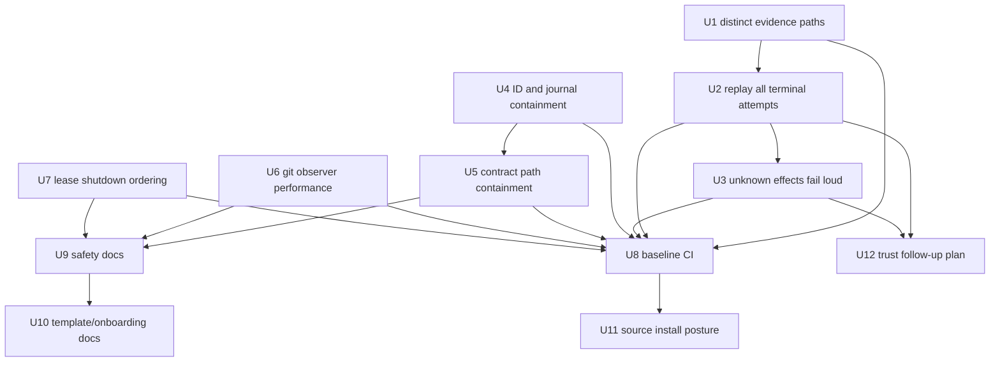
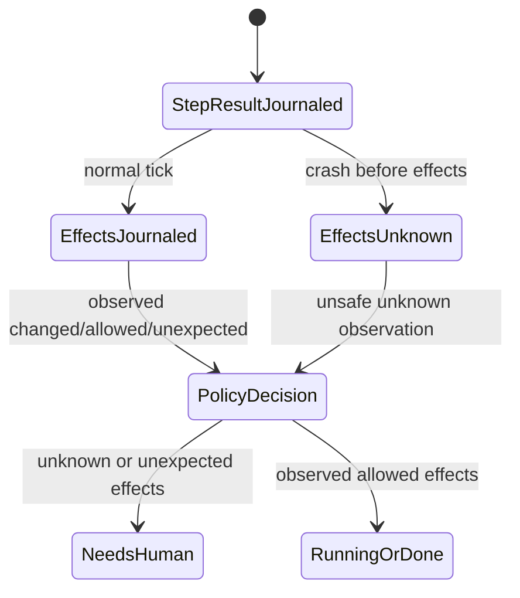

# fix: Harden auditability, recovery, and release guardrails

## Summary

This plan turns the repo review findings into an ordered hardening pass: preserve per-step evidence, make crash replay fail loud instead of assuming clean state, contain path-derived ledger and contract reads, reduce effect-observer cost on real repos, and add release/package guardrails before broader publication.

It also captures the product-direction follow-ups from the review by adding safety/onboarding documentation now and converting the larger trust-promotion lifecycle into a separate follow-up planning artifact, so product work does not get smuggled into runtime bug fixes.

---

## Problem Frame

Vernier's product promise is auditability: typed steps, fungible executors, observed file effects, and an append-only ledger that can be resumed and inspected after failure. The review found several places where that promise is weaker at edge boundaries: evidence artifacts can collide, replay can silently treat unknown effects as allowed, executor-controlled paths can escape intended roots, and release/install paths are not yet guarded by CI/package smoke tests.

The work should protect the core architecture stated in `HANDOFF.md`: the loop remains data, provider quirks stay out of the engine, policy remains pure, and the ledger is the source of truth.

---

## Requirements

- R1. Preserve every worker-backed step's prompt, event, and final evidence artifacts independently, even when multiple steps use the same executor in the same iteration and attempt.
- R2. Resume must never silently convert an unknown post-crash effects state into an allowed clean observation.
- R3. Resume must not re-run a journaled failed or interrupted executor attempt in the mid-tick crash window when that attempt may already have mutated files.
- R4. Ledger run IDs and loop IDs must be safe path components, and journal paths must stay contained under the intended ledger runs root.
- R5. Contract validation must treat executor-reported artifact paths as untrusted: no absolute paths, no relative escapes, no non-regular files, and bounded reads.
- R6. Git-aware effect observation must remain correct while avoiding whole-workdir hashing for obviously irrelevant heavy ignored/cache directories.
- R7. Run leases must cover runtime shutdown so a second driver cannot acquire the lease while provider runtime teardown is still in progress.
- R8. CI and release smoke must verify the deterministic test suite, typecheck, build, package contents, and installed-bin smoke before publication.
- R9. Source installs and script-disabled package builds must fail clearly or be supported intentionally; they must not fall through to a missing devDependency.
- R10. User-facing docs must make provider safety posture, effect observation limits, and package/release expectations visible from the main docs path.
- R11. The trust-promotion lifecycle should be captured as a separate follow-up feature plan, not implemented inside this crash-recovery and packaging hardening pass.

---

## Scope Boundaries

- Do not change the five-slot Loop/Step model or make the engine provider-specific.
- Do not change existing journal entry semantics in a way that breaks `vernier show`, `vernier stats`, or old journals without a compatibility path.
- Do not make live provider tests part of default `npm test`; live proofs stay opt-in behind explicit environment gates.
- Do not add new runtime dependencies for path containment, ID validation, or observer filtering unless implementation proves the standard library is insufficient.
- Do not implement automatic rollback/revert for out-of-scope writes in this pass; detection, journaling, and escalation remain the contract.
- Do not publish to npm or push GitHub workflow changes as part of planning; implementation may add the guardrails, but release remains a separate human action.

### Deferred to Follow-Up Work

- Trust/promotion implementation: this plan only creates the follow-up plan; any `vernier promote`, `trust status`, or ledger-evidence gate code belongs in that separate feature plan.
- External template registry/catalog: keep this out of the hardening pass; improve current template docs and examples first.
- Config-level retriever registration: noted in `HANDOFF.md`, but not related to the review findings.

---

## Context & Research

### Relevant Code and Patterns

- `src/executors/evidence.ts` centralizes worker evidence naming; `src/executors/worker-step.ts` uses the prefix for prompt, events, preflight, and final artifacts.
- `src/ledger/ledger.ts` defines append-only JSONL entries, `journalPath`, `resumeKey`, torn-line loading, and replay maps.
- `src/engine/tick.ts` owns snapshot -> execute -> assess -> validate -> journal -> decide, plus `replayTick` for mid-tick crash recovery.
- `src/engine/resume.ts` reconstructs run state by folding journaled decisions through `nextState` and refuses loop-version mismatches.
- `src/kernel/contract.ts` contains `runTraceV1`, the current executor-reported trace-file contract.
- `src/kernel/effects.ts` and `src/kernel/git-effects.ts` define the effect observer seam and the hash/git observers.
- `src/engine/lease.ts` implements run-dir leases; `src/cli/main.ts` acquires/releases them around `run`, `tick`, and `resume`.
- `bin/vernier.js`, `package.json`, and `README.md` define the package/bin/release contract.
- Existing tests to follow include `test/resume.test.ts`, `test/ledger.test.ts`, `test/tick.test.ts`, `test/git-effects.test.ts`, `test/artifacts.test.ts`, `test/lease.test.ts`, `test/cli.test.ts`, `test/walkthrough.test.ts`, and template tests.

### Institutional Learnings

- No `docs/solutions/` directory exists in this checkout.
- `HANDOFF.md` says provider quirks belong in executors, not the kernel/engine/policy.
- Deterministic fake/scripted workers and PATH-shim probes are the primary verification pattern; live proofs are optional and env-gated.
- Existing plans under `docs/plans/` use explicit requirements, technical decisions, implementation units, scope boundaries, and validation expectations.
- Archived provider plans emphasize verifying provider/runtime claims in tests and keeping provider dialect fixes at the provider boundary.

### External References

- External research was skipped. The work is dominated by repo-local crash-recovery, filesystem containment, packaging, and CI patterns, and the repo already has direct local examples for the relevant test seams.

---

## Key Technical Decisions

- **Fail loud on unknown effects:** When replay cannot prove the post-step effect observation, the plan should journal or surface an indeterminate state and route policy toward escalation. A silent clean default is worse than a noisy handoff.
- **Use stable path-safe IDs:** Validate loop IDs and run IDs as portable path components rather than trying to sanitize arbitrary strings at write time. Unsafe IDs should fail early with actionable errors.
- **Keep containment helpers kernel-level and provider-neutral:** Path containment and scope-pattern validation belong near `src/kernel/effects.ts` / a small adjacent kernel helper because they protect engine and contract semantics, not a specific executor.
- **Preserve backward-readable ledgers:** New replay fields or entries may be additive, but old ledgers should still load and show wherever possible. Unknown or old missing data can be displayed as unknown rather than reinterpreted as allowed.
- **Optimize the git observer without losing ignored-file coverage where it matters:** The current design intentionally observes ignored files. The fix should avoid heavy irrelevant directories by default or make ignores configurable, not blindly delete ignored-file observation.
- **CI is a release guard, not a replacement for local deterministic tests:** Keep `npm test` auth-free and add package/install smoke around the existing compiled-bin contract.
- **Trust promotion is a separate lifecycle feature:** It should read ledger evidence via pure functions and CLI commands rather than entangling with the crash-recovery fixes.

---

## Open Questions

### Resolved During Planning

- **Should the direction suggestions be implemented in the same pass as the bug fixes?** Partially. Safety/onboarding docs are in scope because they explain the hardening work. Full trust promotion is explicitly out of scope for runtime implementation here; this plan only creates a separate follow-up feature plan for that lifecycle.
- **Should the git observer drop ignored-file detection entirely?** No. Existing comments and tests indicate ignored-file attribution is intentional. The plan keeps that guarantee for relevant scopes while reducing unnecessary hashing.
- **Should source installs support unbuilt TypeScript by depending on `tsx` at runtime?** Leave this as an implementation decision between two acceptable outcomes: support source fallback intentionally or fail clearly. The release smoke must make the chosen outcome explicit.

### Deferred to Implementation

- **Exact representation for indeterminate effects:** The implementer should choose whether this is an additive `effects` observation status, a new ledger entry, or an extended observation shape after reading existing renderer/test implications.
- **Exact ID grammar length limit and allowed punctuation:** The plan recommends a conservative alphanumeric plus dot/underscore/dash grammar, but the final helper name and error wording can be settled while updating tests.
- **Exact default skip list for effect hashing:** The implementer should pick the smallest safe default list after checking existing tests and package artifacts; expected candidates include common build/cache outputs beyond `.git`, `node_modules`, and `.vernier`.

---

## High-Level Technical Design

> *This illustrates the intended approach and is directional guidance for review, not implementation specification. The implementing agent should treat it as context, not code to reproduce.*

The runtime hardening units should land before release guardrails so CI protects the fixed behavior. Documentation follows the behavior changes. Source-install posture is fixed before full package smoke enforces it. The trust-promotion follow-up plan depends on clearer replay/effects semantics because future promotion criteria should evaluate truthful ledger evidence.

---

## Implementation Units

### U1. Make worker evidence filenames step-distinct

**Goal:** Prevent evidence artifact collisions when two same-executor worker-backed steps run in the same iteration and attempt.

**Requirements:** R1

**Dependencies:** None

**Files:**
- Modify: `src/executors/evidence.ts`
- Modify: `src/executors/worker-step.ts` if needed for helper usage
- Test: `test/codex-executor.test.ts` or `test/tick.test.ts`
- Test: provider-specific executor tests if they assert exact evidence filenames

**Approach:**
- Extend the shared evidence prefix to include a deterministic safe slug or short hash derived from `spec.stepId`; never write raw step IDs, prompt stems, provider stems, or final stems as unchecked path components.
- Assert or construct evidence paths so they remain under `spec.runDir` even when configured IDs contain separators or traversal-like strings.
- Keep evidence paths stable enough for human inspection and ledger references; do not use random values unless a deterministic resume key hash is also recorded.
- Use one shared helper so Codex, Claude, Cursor, opencode, pi, and unsupported-sandbox preflight evidence all follow the same naming rule.
- Update only tests that depend on exact artifact names; preserve evidence roles and file contents.

**Execution note:** Start with a failing regression test that runs two worker-backed steps with the same executor/stem in one run and proves their evidence paths and contents remain distinct.

**Patterns to follow:**
- `src/executors/evidence.ts` for shared naming.
- `src/executors/worker-step.ts` for prompt/events/final file writes.
- Existing fake worker tests in executor suites for avoiding live provider calls.

**Test scenarios:**
- Happy path: two same-executor steps in the same iteration and attempt each produce unique prompt, events, and final evidence paths.
- Integration: the ledger records each step_result with references to files whose contents match that step's prompt/final output, not the later step's output.
- Edge case: retry and iterate prefixes still distinguish second attempts and later iterations after the step discriminator is added.
- Error path: unsupported-sandbox preflight evidence also uses a step-distinct path and does not overwrite another step's preflight file.
- Error path: step IDs or stems containing `/`, `..`, absolute-path shapes, empty strings, or separators are slugged/hashed safely and cannot escape `runDir`.

**Verification:**
- Every worker-backed evidence reference in a multi-step run points to a unique file unless the same step is intentionally being replayed from the ledger.
- Existing executor tests still pass without live CLIs.

### U2. Replay all terminal step results instead of completed-only results

**Goal:** Prevent resumed runs from re-executing a failed or interrupted attempt that was already journaled before a mid-tick crash.

**Requirements:** R3

**Dependencies:** U1 is independent but should land first if evidence regression tests inspect replay evidence.

**Files:**
- Modify: `src/ledger/ledger.ts`
- Modify: `src/engine/tick.ts`
- Test: `test/resume.test.ts`
- Test: `test/ledger.test.ts`

**Approach:**
- Change the replay projection so terminal `step_result` entries are replayable regardless of `status`.
- Preserve the existing behavior that replay does not invoke the executor for a journaled slot.
- Ensure replayed failed/interrupted results still build an `Observation` with the correct `stepStatus`, invalid output handling, and policy outcome when effects are known; U3 handles the unsafe unknown-effects branch.
- Keep old journals readable; if old journals lack newer fields, interpret only the durable data they actually contain.

**Execution note:** Add characterization coverage around current completed replay before broadening replay to failed/interrupted statuses.

**Patterns to follow:**
- `test/resume.test.ts` uses truncated journals to simulate crashes.
- `resumeKey` in `src/ledger/ledger.ts` is the slot identity; do not make executor ID or skill delivery part of the replay key.

**Test scenarios:**
- Happy path: crash after a failed `step_result` but before decision resumes without calling the executor again and applies policy to the journaled failed result.
- Happy path: crash after an interrupted `step_result` but before decision resumes without calling the executor again.
- Integration: a side-effecting failed script/executor that wrote a file before failing is not double-applied during resume.
- Edge case: completed replay behavior remains unchanged for the existing crash-after-step-result scenario.
- Error path: malformed or missing step in the loop still reports an actionable resume error rather than executing a mismatched slot.

**Verification:**
- Resume is idempotent for all terminal executor statuses in the crash window between `step_result` and `decision`.
- Replay maps and naming make clear that the collection is no longer completed-only.

### U3. Represent unknown post-crash effects explicitly

**Goal:** Replace the current assumed-clean replay fallback with an explicit unknown/indeterminate effects state that policy and CLI surfaces can treat as unsafe.

**Requirements:** R2, R3

**Dependencies:** U2

**Files:**
- Modify: `src/engine/tick.ts`
- Modify: `src/kernel/policy.ts`
- Modify: `src/kernel/types.ts` if the observation shape changes
- Modify: `src/ledger/ledger.ts` if the durable observation shape changes
- Modify: `src/ledger/stats.ts` if timeline/stats need to render unknown effects
- Modify: `src/cli/main.ts` if `show` output should display the unknown state
- Test: `test/resume.test.ts`
- Test: `test/cli.test.ts`
- Test: `test/stats.test.ts` if stats/timeline output changes

**Approach:**
- When replay finds a journaled step_result but no effects entry, do not synthesize `allowed: true`.
- Persist a durable additive observation state that means “effects were not observed because the crash happened before the effects entry”; do not leave this only as an in-memory computation.
- Route this state to policy as unsafe for every terminal step status so it preempts retry/continue and requires human attention.
- Make repeated resumes idempotent: the unknown-effects evidence should not be appended over and over for the same resume key.
- Make the human and JSON timeline clear enough that operators understand why the run needs attention.
- Preserve deterministic contract recomputation for missing contract entries; only the side-effect observation is treated as unknowable.

**Technical design:**

> *Directional guidance, not implementation specification.*

**Patterns to follow:**
- Current `replayTick` recomputes deterministic pieces and appends the missing tail.
- `vernier show --json` is additive and should stay machine-readable.

**Test scenarios:**
- Happy path: crash after completed `step_result` but before `effects` causes resume to emit/escalate an unknown effects observation rather than allowed clean state.
- Happy path: crash after failed `step_result` but before `effects` treats effects as unknown, does not re-run the failed attempt, and does not execute a next retry attempt before human review.
- Integration: `vernier show` human output and `--json` output make the unknown effects state visible.
- Edge case: if the effects entry is present, replay uses the ledgered observation exactly and does not recompute or downgrade it.
- Error path: an old journal missing effects in this crash window remains loadable and produces a safe escalation rather than a stack trace.

**Verification:**
- There is no code path in replay that defaults missing effects to `allowed: true`.
- Operators can distinguish “no files changed” from “effects were not observed,” and the journal durably explains why policy escalated.

### U4. Validate loop IDs, run IDs, and journal path containment

**Goal:** Ensure ledger paths stay under the intended runs root and unsafe IDs fail before they become filesystem paths.

**Requirements:** R4

**Dependencies:** None

**Files:**
- Modify: `src/ledger/ledger.ts`
- Modify: `src/kernel/types.ts` or config/registry validation helpers if needed
- Modify: `src/cli/config.ts`
- Modify: `src/cli/main.ts`
- Test: `test/ledger.test.ts`
- Test: `test/config.test.ts`
- Test: `test/cli.test.ts`

**Approach:**
- Introduce a small shared validator for IDs used as path components.
- Validate loop IDs during config/registry loading so unsafe loop definitions fail before `run` creates a run directory.
- Validate positional run IDs accepted by `show`, `tick`, and `resume` before resolving `journalPath`.
- Add a containment assertion inside `journalPath` or an adjacent helper so future callers cannot bypass validation accidentally.
- Treat symlinked run directories as unsafe unless implementation can prove realpath containment under the ledger runs root; check resolved parent paths, not only string prefixes.
- Keep generated run IDs compatible with existing safe loop IDs and timestamp suffixes.

**Patterns to follow:**
- `src/cli/config.ts` raises `ConfigError` with actionable schema/config messages.
- `src/cli/main.ts` raises `UsageError` for invalid command inputs.
- `test/config.test.ts` and `test/cli.test.ts` assert exit-2 usage/config failures without stack traces.

**Test scenarios:**
- Happy path: existing safe loop IDs generate journal paths under `.vernier/runs` and existing run commands still work.
- Error path: loop IDs containing `/`, `..`, empty strings, path separators, or leading traversal fail during config/registry load with actionable errors.
- Error path: `show`, `tick`, and `resume` reject positional run IDs that contain traversal or path separators before reading outside the runs root.
- Edge case: a run ID containing allowed punctuation such as dot, underscore, or dash remains valid if it matches the final grammar.
- Integration: `runs` listing still works for existing safe run directories and skips/handles invalid legacy directories without crashing.
- Error path: symlinked run directories or journal parent paths that resolve outside the ledger root are rejected or ignored safely.

**Verification:**
- No public CLI command can resolve a journal path outside the configured ledger runs root using a run ID string alone.
- Unsafe loop IDs never reach `newRunId` / run-dir creation.

### U5. Contain and bound run-trace contract file reads

**Goal:** Treat `output.trace` from executors as an untrusted relative artifact path and read it safely during contract validation.

**Requirements:** R5

**Dependencies:** U4 if a shared path helper is introduced there; otherwise independent.

**Files:**
- Modify: `src/kernel/contract.ts`
- Create or modify: `src/kernel/paths.ts` if a shared helper is useful
- Test: `test/verified-answer-template.test.ts` or `test/coding-review-template.test.ts` if templates exercise `run-trace.v1`
- Test: a focused contract test file if one exists or is added near current contract coverage

**Approach:**
- Reject absolute trace paths and relative paths that escape the workdir.
- Preserve current workdir-relative `output.trace` semantics: valid traces are relative to `ctx.workdir`; runDir/evidence paths are not accepted for `run-trace.v1` in this pass.
- Resolve the trace path against `ctx.workdir`, then assert realpath containment before any read.
- Require a regular file and cap the number of bytes read for validation. Use `lstat`/file-handle `fstat` style checks where practical so symlinks, non-regular files, and obvious stat/read races fail safely.
- Preserve current check labels where possible, but make failure details safe and actionable.
- Do not log or journal file contents when validation fails.

**Execution note:** Implement this test-first with malicious executor-output paths before changing the contract helper.

**Patterns to follow:**
- `runTraceV1` returns structured `ContractCheck` objects rather than throwing for normal validation failures.
- Existing template tests cover contract behavior through real loop execution; add a smaller direct contract test if that keeps edge cases clearer.

**Test scenarios:**
- Happy path: a valid workdir-relative trace file passes the existing trace-heading, trace-id, loop-id, loop-version, classification, and improvement checks.
- Error path: absolute trace paths fail validation without reading the target file.
- Error path: `../` relative escapes fail validation without reading outside the workdir.
- Error path: symlink, symlink-race, or non-regular-file trace targets fail validation safely.
- Error path: oversized trace files fail validation or read only within the cap without exhausting memory.
- Edge case: missing trace output still produces the existing “trace file exists” style failure rather than throwing.

**Verification:**
- Contract validation cannot be used to synchronously read arbitrary files outside the intended artifact root.
- Contract failures remain ledger-friendly structured results.

### U6. Reduce git observer hashing cost while preserving relevant ignored-file attribution

**Goal:** Make `gitObserver` scale better on real repos without removing the intentional ability to catch ignored-file changes that matter to effect scopes.

**Requirements:** R6

**Dependencies:** U5 if shared path/scope helpers are reused; otherwise independent.

**Files:**
- Modify: `src/kernel/effects.ts`
- Modify: `src/kernel/git-effects.ts`
- Modify: `src/engine/tick.ts` if the observer snapshot API becomes scope-aware
- Test: `test/git-effects.test.ts`
- Test: `test/tick.test.ts` or `test/artifacts.test.ts` if effect scope semantics change

**Approach:**
- Keep `gitTreeSnapshot` and throwaway-index behavior for tracked/untracked non-ignored files.
- Choose one explicit observer strategy before implementation: either pass `EffectScope` into `EffectsObserver.snapshot` so ignored-file scanning can be scope-aware, or keep the current seam and limit optimization to a conservative static skip list whose skipped paths are documented as intentionally unobserved.
- Preserve ignored-file detection for files that are inside the declared effect scope unless the user explicitly configured those paths as unobserved.
- Do not add default skips that would hide unexpected writes without clear documentation and regression coverage.
- Keep changed paths workdir-relative, POSIX-normalized, sorted, and compatible with `isAllowed` / `artifactFromEffects`.
- Document the performance/safety trade-off in code comments and user docs.

**Patterns to follow:**
- Existing `test/git-effects.test.ts` uses real temp git repositories and should remain deterministic.
- `EffectsObserver` should stay simple; if the seam changes to `snapshot(workdir, scope)`, update fake/custom observers and tests in the same unit.

**Test scenarios:**
- Happy path: tracked edits, untracked adds, and deletes are still reported by the git observer.
- Happy path: ignored files inside an allowed effect scope are still reported when they are relevant to scope checking.
- Edge case: heavy ignored/cache directories outside scope are skipped or avoided only according to the chosen explicit strategy.
- Edge case: changed paths remain sorted and normalized with forward slashes.
- Error path: if git plumbing fails because the workdir is not a git repo, existing fallback/usage behavior remains clear.
- Integration: `artifactFromEffects` still projects exactly one allowed changed artifact after the observer optimization.

**Verification:**
- Git observer tests prove no real index mutation, correct attribution, and reduced irrelevant hashing scope.
- The default hash observer for non-git workdirs remains simple and deterministic.

### U7. Hold run lease until runtime shutdown finishes

**Goal:** Keep the run lease active until provider runtime teardown has been attempted, so another driver cannot take the lease during shutdown.

**Requirements:** R7

**Dependencies:** None

**Files:**
- Modify: `src/cli/main.ts`
- Test: `test/cli.test.ts`
- Test: `test/lease.test.ts` if direct lease behavior needs coverage

**Approach:**
- In `cmdRun` and `cmdTickOrResume`, attempt `runtime.shutdown()` before releasing the lease.
- Use nested `finally` handling so the lease is still released even when shutdown throws or rejects.
- Add a bounded, testable shutdown timeout or explicitly prove/document that provider shutdown cannot hang. Preserve primary run/tick/resume errors ahead of shutdown/release errors, while still surfacing shutdown failures diagnostically.
- Preserve current JSON stdout cleanliness and human notes on stderr.

**Patterns to follow:**
- Existing lease tests cover live lease blocking, stale takeover, release, and owner checks.
- `src/cli/main.ts` already treats lease release as a CLI lifecycle concern, not an engine concern.

**Test scenarios:**
- Happy path: a normal run shuts down runtime and then releases the lease.
- Error path: when runtime shutdown rejects, the lease is still released and the original/appropriate error behavior remains visible.
- Error path: while shutdown is pending, a second driver cannot acquire the same lease.
- Integration: `run --json`, `tick --json`, and `resume --json` still keep stdout machine-clean and put lifecycle diagnostics on stderr.

**Verification:**
- The lease file remains owned through runtime shutdown and is removed after teardown attempt completes.
- CLI exit behavior remains compatible with current tests.

### U8. Add baseline CI and deterministic release guardrails

**Goal:** Make deterministic verification visible and automated before publication, leaving source-install negative/package-posture checks for U11.

**Requirements:** R8

**Dependencies:** U1-U7 should land first or this unit should be merged after them so CI protects the runtime hardening behavior.

**Files:**
- Create: `.github/workflows/ci.yml`
- Modify: `package.json`
- Create: a release/package smoke script under `scripts/` if package scripts would become unwieldy
- Test: package smoke can be covered by the script itself and CI workflow expectations

**Approach:**
- Add a GitHub Actions workflow for Node 22 that runs `npm ci`, typecheck, deterministic tests, and build.
- Set workflow permissions to read-only (`contents: read`), require no secrets, and avoid publish/deploy/upload side effects.
- Add a positive local release-smoke script only if it can pass against the current intended package posture; defer missing-`dist` and script-disabled negative checks to U11.
- Keep live provider tests out of default CI unless a separate opt-in workflow is added later.
- Decide whether to enforce `npm audit --omit=dev` in CI; do not fail CI on current dev-only Vitest/Vite advisories unless the implementation also upgrades dev dependencies safely.

**Patterns to follow:**
- `test/walkthrough.test.ts` already proves init/run behavior in bare scratch dirs.
- `README.md` Development section lists `npm install`, `npm test`, `npm run build`, and `npm run typecheck`.

**Test scenarios:**
- Happy path: workflow runs deterministic verification on Node 22 with no agent credentials.
- Happy path: any positive release smoke installs the packed artifact into a temp consumer and runs the smoke template through the installed bin.
- Error path: CI uses `npm ci` and fails on typecheck/test/build regressions.
- Integration: package scripts remain usable locally on macOS/Linux and do not rely on repo-local global links.

**Verification:**
- A clean checkout can run the documented local verification scripts without live provider credentials.
- CI workflow is minimal, readable, and does not publish artifacts or mutate external systems.

### U9. Centralize safety posture documentation

**Goal:** Make provider confinement, post-run effect attribution, unknown effects, and trusted config boundaries easy to find from the README.

**Requirements:** R10

**Dependencies:** U3, U5, U6, U7 so docs match implemented semantics.

**Files:**
- Create: `docs/safety.md`
- Modify: `README.md`
- Modify: `docs/provider-executors.md`
- Modify: `docs/walkthrough.md` if crash/replay wording changes
- Test: `test/walkthrough.test.ts` if docs snippets are executable

**Approach:**
- Add a provider safety matrix covering pre-write confinement, post-run effect attribution, effect-free read-only enforcement, write-scope support, and recommended use.
- Explicitly distinguish provider-enforced confinement, permission gating, and Vernier post-run detection/escalation.
- Document trusted config code execution and the fact that ledger inputs/outputs/evidence may persist sensitive data.
- Document the new unknown-effects resume behavior so users understand why a resumed run may need human attention.
- Link this page from the README's Effects And Trust and Providers sections.

**Patterns to follow:**
- `README.md` uses concise tables for provider setup and template overview.
- `docs/provider-executors.md` holds provider-specific detail; `docs/safety.md` should be the central overview, not a duplicate of every adapter detail.

**Test scenarios:**
- Test expectation: none for static prose unless executable snippets are added or changed. If snippets change, cover them through existing walkthrough/template tests.

**Verification:**
- A new user can reach safety posture guidance from README without reading `HANDOFF.md` or executor headers.
- Docs no longer describe missing effects or provider read-only claims in a way that contradicts runtime behavior.

### U10. Improve template and example onboarding funnel

**Goal:** Make templates/examples the main product path after the hardening work, without adding a template registry or new product surface prematurely.

**Requirements:** R10

**Dependencies:** U8 and U9 are recommended first so onboarding points at the verified package and safety docs.

**Files:**
- Create: `examples/getting-started/README.md`
- Modify: `README.md`
- Modify: `templates/*/README.md` only where safety/release wording needs alignment
- Test: `test/walkthrough.test.ts` if new commands are included as executable examples

**Approach:**
- Add a concise example README explaining what each file demonstrates and the exact no-auth commands to run.
- Link templates and examples as the recommended funnel: `vernier init smoke` for first proof, then agent-backed templates after `vernier doctor`.
- Avoid introducing a template registry, plugin catalog, or new CLI command unless implementation shows the current docs cannot carry onboarding.
- Keep example commands consistent with package smoke and README install paths.

**Patterns to follow:**
- Existing template READMEs are short and task-oriented.
- `README.md` Docs By Goal section already points to examples and templates.

**Test scenarios:**
- Test expectation: none for prose-only additions unless executable command blocks are added to the walkthrough test surface.

**Verification:**
- A reader landing in `examples/getting-started` can run a deterministic example without inferring commands from the long walkthrough.
- The docs consistently steer users to templates before advanced customization.

### U11. Make source-install and script-disabled package behavior intentional

**Goal:** Ensure unbuilt source installs either work by design or fail with a clear build-required message instead of importing an absent devDependency.

**Requirements:** R8, R9

**Dependencies:** U8 for baseline CI; U11 extends release smoke after the package posture is chosen.

**Files:**
- Modify: `bin/vernier.js`
- Modify: `package.json`
- Modify: `README.md`
- Test: package smoke script from U8
- Test: `test/cli.test.ts` if bin fallback behavior is covered there

**Approach:**
- Choose one supported posture during implementation:
  - Support source fallback intentionally by ensuring `tsx` is available where fallback runs, or
  - Treat missing `dist` as a build-required error for installed/package contexts while preserving dev ergonomics through `npm run vernier`.
- Make the chosen behavior explicit in README install/development docs.
- Add or extend package-smoke coverage for the normal published artifact path and an explicit negative/diagnostic check for missing `dist` if script-disabled installs are unsupported.
- Do not silently move `tsx` to production dependencies unless the project intentionally supports running TypeScript source in consumer installs.

**Patterns to follow:**
- `bin/vernier.js` already clearly prefers `dist` and has comments explaining dev fallback.
- `package.json` `prepack` currently builds `dist`; U8 should verify this contract externally through packed install.

**Test scenarios:**
- Happy path: normal packed artifact installs and runs the compiled CLI under plain Node without `tsx`.
- Error path: if `dist` is absent in an installed/package context, the CLI fails with a clear message explaining how to build or install a proper package.
- Edge case: local development still has a supported way to run the TypeScript CLI without manually building after every edit.
- Integration: package smoke catches absence of `dist` or an unsupported missing-`dist` fallback before publish, according to the chosen posture.

**Verification:**
- The bin no longer falls through to a missing devDependency in consumer-like installs.
- README install instructions match the actual supported paths.

### U12. Create the follow-up trust-promotion lifecycle plan

**Goal:** Capture the trust direction suggestion in a separate feature plan instead of implementing trust-promotion code inside this hardening pass.

**Requirements:** R11

**Dependencies:** U2 and U3, because the follow-up plan should build promotion criteria on truthful observed-vs-unknown ledger evidence.

**Files:**
- Create: `docs/plans/2026-06-17-002-feat-trust-promotion-lifecycle-plan.md`
- Reference: `HANDOFF.md`
- Reference: `src/kernel/types.ts`
- Reference: `src/ledger/ledger.ts`
- Reference: `src/ledger/stats.ts`

**Approach:**
- Write a separate `feat` plan for `vernier promote` / trust status only after U2 and U3 define durable replay/effects semantics.
- Keep this unit planning-only: no changes to `src/kernel/types.ts`, `src/ledger/*`, `src/cli/main.ts`, or docs beyond the new follow-up plan file.
- The follow-up plan should evaluate promotion criteria as pure functions over ledger evidence, preserve current `draft` gating, and explicitly decide whether human approval records are in the first implementation slice.
- If implementation starts before that follow-up plan exists, stop and create the trust plan first rather than adding trust CLI behavior opportunistically.

**Patterns to follow:**
- Existing plan structure in `docs/plans/2026-06-15-001-feat-cursor-workspace-write-plan.md`.
- `src/ledger/stats.ts` as an example of pure derivations over journal data.
- `HANDOFF.md` deferred trust/promotion lifecycle notes.

**Test scenarios:**
- Test expectation: none -- this unit creates a follow-up plan document, not runtime behavior. The follow-up plan must define its own tests before any trust-promotion code is implemented.

**Verification:**
- The separate trust-promotion plan exists, references U2/U3 semantics, and keeps runtime trust implementation out of this hardening plan.
- This hardening plan has no active implementation unit that adds `vernier promote`, trust status, or promotion records.

---

## System-Wide Impact

- **Interaction graph:** Evidence naming affects all worker-backed executors; replay/effects changes affect `run`, `tick`, `resume`, `show`, and `stats`; path containment affects config, ledger, contracts, and CLI positional inputs; CI/package smoke affects release workflow only.
- **Error propagation:** Unsafe IDs and paths should become usage/config/contract validation failures, not uncaught filesystem exceptions. Unknown effects should become explicit escalation/needs-human state rather than success.
- **State lifecycle risks:** The highest-risk state transition is crash after `step_result` and before `effects`/`decision`. U2 and U3 make that transition replayable and auditable without double execution or silent clean defaults.
- **API surface parity:** Any new CLI command or output field must support `--json` where applicable and avoid breaking existing human output unless tests are updated deliberately.
- **Integration coverage:** Unit tests alone are not enough for resume and package smoke. The plan requires cross-layer tests that drive CLI/run/resume and inspect ledger outputs.
- **Unchanged invariants:** `npm test` remains auth-free; live provider tests stay opt-in; provider quirks remain in executor adapters; the engine remains provider-agnostic.

---

## Risks & Dependencies

| Risk | Mitigation |
|------|------------|
| Replay fixes accidentally re-run side-effecting steps or skip policy decisions | Add crash-window tests in `test/resume.test.ts` before and after replay changes; assert executor call counts. |
| Unknown effects shape breaks old journal rendering | Keep changes additive and make `show`/`stats` tolerate old journals; test old-style missing entries. |
| Path ID validation rejects existing user run directories | Choose a conservative grammar compatible with generated IDs; make `runs` listing tolerant of invalid legacy dirs. |
| Contract path containment blocks legitimate artifact paths | Preserve current workdir-relative `output.trace` semantics, document that root, and add happy-path template/direct contract tests. |
| Git observer optimization misses ignored out-of-scope writes | Preserve ignored-file checks for relevant scopes; add regression tests with ignored files inside and outside scope. |
| CI package smoke becomes slow or flaky | Keep smoke deterministic and no-auth; avoid live providers and global `npm link`. |
| Trust follow-up expands into product implementation | Keep U12 planning-only in this hardening pass; all trust CLI/runtime work belongs in `docs/plans/2026-06-17-002-feat-trust-promotion-lifecycle-plan.md` or a later feature plan. |

---

## Documentation / Operational Notes

- Update README, provider docs, safety docs, and walkthrough only after runtime semantics land so docs do not promise behavior before it exists.
- Keep release instructions clear that `npm test` is deterministic and no-auth; live provider proofs remain separate.
- If CI is added, document which checks are mandatory for contributors and which are release-only.
- If the U12 follow-up plan is created, it should preserve the current warning that `dry-run` and `active` are labels until a separate implementation actually adds ledger-backed promotion records/criteria.

---

## Validation Plan

- Deterministic verification should include typecheck, auth-free tests, build, baseline CI, and package smoke after U11 defines the package posture.
- Focused runtime regression tests should cover evidence collision, resume after failed/interrupted `step_result`, missing effects replay, ID containment, contract path containment, git observer attribution, and lease shutdown ordering.
- Package verification should install the packed artifact into a scratch consumer project and run the smoke template using the installed bin; missing-`dist`/script-disabled behavior is enforced after U11 chooses the supported posture.
- Live provider tests remain optional and should not be required for this hardening pass unless a specific provider adapter changes.

---

## Sources & References

- Repo review findings from this session, mapped to R1-R11.
- `HANDOFF.md`
- `README.md`
- `docs/provider-executors.md`
- `docs/walkthrough.md`
- `docs/plans/2026-06-15-001-feat-cursor-workspace-write-plan.md`
- Runtime code: `src/executors/evidence.ts`, `src/executors/worker-step.ts`, `src/ledger/ledger.ts`, `src/engine/tick.ts`, `src/engine/resume.ts`, `src/kernel/contract.ts`, `src/kernel/effects.ts`, `src/kernel/git-effects.ts`, `src/engine/lease.ts`, `src/cli/main.ts`, `bin/vernier.js`, `package.json`
