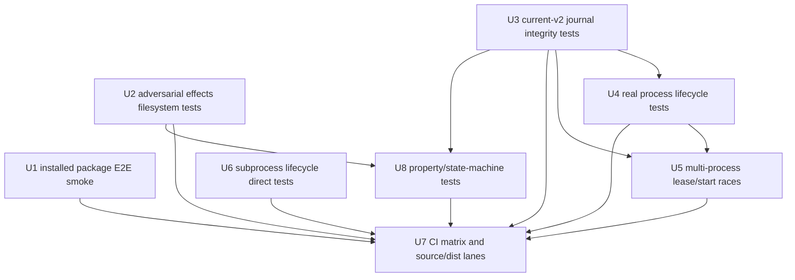

# fix: Add chaotic release-confidence tests

## Summary

This plan turns the testing audit into a test-first hardening pass for Vernier’s public-consumption bar: the installed package must run a real loop, effect observation must survive adversarial filesystems, current-v2 journals must fail closed on corrupt shapes, process/lease/subprocess lifecycles must be exercised with real chaos, CI must prove source and package paths explicitly, and property tests must explore the state-machine invariants examples can miss.

---

## Problem Frame

Vernier already has a strong deterministic beta-quality suite, but its highest-risk claims are about real-world boundaries: append-only recovery, effect attribution, process death, package installability, and concurrent drivers. The current tests cover many hand-picked paths; they do not yet prove enough chaotic boundary behavior to make “ready for public consumption” a defensible claim.

This plan builds on `docs/plans/2026-06-17-001-fix-auditability-recovery-release-guardrails-plan.md`, treating the existing hardening work as the baseline and adding the deeper test coverage requested by the audit.

---

## Requirements

- R1. `npm run smoke:package` must prove a packed, installed package can scaffold and run a deterministic loop from a clean consumer directory, not just print help or import exports.
- R2. Effect observation tests must cover adversarial filesystem shapes that can undermine the safety claim: symlinks, non-regular files, permission failures, deletes, hard links where feasible, and scope-boundary path matching.
- R3. Current `loop-v2` journal tests must make integrity policy explicit: tolerated crash windows remain resumable, malformed-but-parseable corruption fails closed with clear diagnostics, and legacy compatibility is deliberate rather than accidental.
- R4. Real child-process tests must cover SIGTERM, SIGINT, SIGKILL, lease cleanup/staleness, and resume behavior after process death at journal boundaries.
- R5. Multi-process tests must characterize lease and run-start races, proving at most one driver advances a run or documenting any accepted best-effort limitation.
- R6. `runJsonlSubprocess` must have direct lifecycle tests for framing, abort, watchdog, kill escalation, stderr bounding, spawn failures, and settle-once races without live provider CLIs.
- R7. CI must separate source, dist/package, and chaos lanes across the OS/Node versions Vernier claims to support, while keeping default PR checks deterministic and auth-free.
- R8. Property/state-machine tests must explore replay, policy, keying, and effect-scope invariants with replayable seeds and pinned counterexample regressions.

---

## Scope Boundaries

- This is a test-first hardening plan. Runtime fixes are in scope only when a new test exposes behavior that contradicts Vernier’s safety/recovery contract.
- Do not add live provider calls to default `npm test` or PR CI. Provider live tests remain opt-in behind explicit environment gates.
- Do not publish to npm, create a GitHub release, or enable release-side-effect CI actions. Editing CI workflow files for deterministic verification is in scope.
- Do not change Vernier’s core model: loop data, typed steps, fungible executors, pure policy, append-only ledger.
- Do not implement trust promotion gates here; `docs/plans/2026-06-17-002-feat-trust-promotion-gate-plan.md` remains the separate product follow-up.
- Do not require Windows support unless implementation intentionally adds and documents it. If Windows remains unsupported, the CI plan should state that explicitly rather than implying support.

### Deferred to Follow-Up Work

- Nightly/high-repeat chaos automation beyond the deterministic seed set: add after the fast PR-tier tests are stable.
- Live provider workflow expansion: keep separate from deterministic release-confidence tests and only enable when credentials/secrets handling is settled.
- Documentation refresh for stale `HANDOFF.md` notes: only update in this pass where test work directly changes the documented release/check posture.

---

## Context & Research

### Relevant Code and Patterns

- `package.json` defines `verify`, `smoke:package`, the Node engine, package exports, bin path, package files, and dependencies.
- `scripts/package-smoke.mjs` currently packs, installs in a temp consumer, runs installed `vernier --help`, and checks public imports.
- `templates/smoke/` and the template metadata drive the no-auth consumer flow that package smoke must exercise.
- `src/cli/main.ts` discovers configs/templates and registers dependency-lending hooks for fresh scaffolds, so package smoke must isolate cwd/env state to avoid accidental checkout resolution.
- `.github/workflows/ci.yml` currently runs a single Ubuntu Node 22 verification lane.
- `bin/vernier.js` prefers `dist/cli/main.js` and falls back to source through `tsx` in development checkouts; release/package lanes should prove the installed path uses built `dist`, not the dev fallback.
- `vitest.config.ts` aliases `vernier` to `src/index.ts`, so normal tests are source-lane tests and cannot be reused as proof of packaged `exports` or built `dist` behavior.
- `src/kernel/effects.ts` and `src/kernel/git-effects.ts` provide the hash and git-aware observers.
- `src/ledger/ledger.ts` defines `KEY_VERSION`, `resumeKey`, JSONL loading, replay maps, safe run IDs, and journal containment.
- `src/engine/resume.ts` folds journal decisions through `nextState` and disables replay maps for pre-v2 compatibility.
- `src/engine/tick.ts` owns start/tick/replay behavior and side-effecting execution boundaries.
- `src/engine/lease.ts` owns run-dir leases and documents stale-takeover race limits.
- `src/cli/main.ts` owns run/tick/resume orchestration, real process exit classes, signal handlers, and runtime shutdown ordering.
- `src/executors/vendor/omegacode/subprocess-jsonl.ts` is the shared JSONL subprocess helper used by provider workers.
- Existing test patterns to follow: `test/cli.test.ts`, `test/walkthrough.test.ts`, `test/resume.test.ts`, `test/ledger.test.ts`, `test/effects.test.ts`, `test/git-effects.test.ts`, `test/lease.test.ts`, `test/cursor-worker.test.ts`, and provider executor tests.

### Institutional Learnings

- `docs/solutions/` does not exist in this checkout.
- `HANDOFF.md` and `docs/safety.md` establish Vernier’s architecture promise: loop as data, step typed, executor fungible, policy pure, ledger append-only.
- Default tests are deterministic and auth-free; live provider proofs are explicitly gated by environment variables such as `VERNIER_LIVE` and provider-specific flags.
- Existing tests prefer real temp directories, real spawned CLI processes, exact ledger inspection, scripted fake workers, and surgical journal edits for crash-window characterization.
- `HANDOFF.md` has stale rough-edge wording around package smoke depth and torn-effects resume behavior; this plan should avoid relying on those stale statements as source of truth.

### External References

- External web research was skipped. The work is dominated by repo-local safety, process, filesystem, package, and CI seams, and the repo already has direct local patterns for those seams.

---

## Key Technical Decisions

| Decision | Rationale |
|---|---|
| Keep deterministic PR-tier tests auth-free | The package is a developer tool; release confidence should not require provider credentials or external service availability. |
| Add runtime fixes only as tests expose contract failures | The user asked for fixes for test gaps, but the plan should avoid speculative refactors. Tests define the missing confidence; implementation corrects only proven violations. |
| Treat current-v2 journal integrity as fail-closed | Vernier’s trust claim depends on journals being durable evidence, not loosely parsed suggestions. Legacy compatibility can remain explicit, but current-format corruption should not silently become success. |
| Separate source, dist, package, and live-provider lanes | These lanes answer different questions: source correctness, built CLI behavior, consumer installability, and provider drift. Blending them hides failures. |
| Use seeded property tests for invariants, not broad unbounded fuzzing | The first property layer should be reproducible, PR-friendly, and counterexample-driven; heavier random chaos belongs in a later nightly lane. |

---

## Open Questions

### Resolved During Planning

- **Should this update the completed auditability plan in place or create a new plan?** Create a new plan. The prior plan is completed baseline hardening; this request is a second testing-confidence pass.
- **Should live provider tests be part of this work?** No for default CI. The plan may preserve or document live-provider gates, but deterministic release readiness should not depend on provider credentials.
- **Should property tests add a new dependency?** Yes, if implementation confirms `fast-check` fits the repo’s Node/Vitest setup and runtime budget. If not, the fallback is a small seeded generator harness, but property-testing semantics should still be explicit.

### Deferred to Implementation

- **Exact schema-validation helper for `LedgerEntry`:** The plan requires explicit current-v2 integrity behavior; the implementer should decide whether to add a small validator, reuse existing types defensively, or localize validation in replay/resume after writing the first failing tests.
- **Exact race-test repeat count:** Use a low deterministic count in PR checks and leave high-repeat stress loops for a later nightly workflow.

---

## Contract Source Matrix

| Area | Contract source | Release-bar expectation |
|---|---|---|
| Installed package E2E | Public install path in `README.md`, package metadata in `package.json`, and existing `smoke:package` script | Existing release contract made deeper: packed install must scaffold and run a no-auth loop from a clean consumer. |
| Effect observation | `docs/safety.md` fail-loud effect-observation model and existing observer tests | Existing safety contract made explicit: safety-relevant unknown filesystem shapes must be attributed or fail closed, not silently clean. |
| Current-v2 journal integrity | Ledger-as-source-of-truth architecture and `KEY_VERSION` replay design | New release-blocking hardening contract: current-format corruption fails closed; legacy compatibility remains explicit. |
| Process lifecycle and leases | CLI exit classes, lease ownership semantics, and documented lease limits | Existing operational contract characterized under real process death; stale takeover is not claimed adversarially safe unless hardened. |
| Subprocess lifecycle | Provider worker reliability seam in `runJsonlSubprocess` | Existing helper behavior tested directly so provider wrappers inherit known lifecycle guarantees. |
| CI matrix | Public Node engine and release smoke expectations | Release support signal made explicit: Ubuntu/macOS Node 22 blocking, current Node advisory, Windows unsupported unless added deliberately. |
| Property/state-machine tests | Pure policy/replay/effect invariants already encoded in examples | New confidence layer for invariant discovery; counterexamples become explicit regressions rather than hidden fuzz-only failures. |

---

## High-Level Technical Design

> *This illustrates the intended approach and is directional guidance for review, not implementation specification. The implementing agent should treat it as context, not code to reproduce.*

The fastest release signal is the installed package smoke, but the broad CI matrix should wait until the deeper deterministic tests are stable. Journal integrity underpins process and race tests because resume semantics determine whether a crash prefix is safe, corrupt, or escalated.

---

## Implementation Units

### U1. Expand installed-package smoke into a true consumer E2E

**Goal:** Prove the packed artifact can be installed into a clean consumer project, scaffold a deterministic template, run it, inspect it, and import the public API without relying on repo-local source or dev dependencies.

**Requirements:** R1, R7

**Dependencies:** None

**Files:**
- Modify: `scripts/package-smoke.mjs`
- Modify: `package.json` if script separation is needed
- Reference/package surface: `templates/smoke/**`
- Reference/package surface: `src/cli/main.ts`
- Test: package smoke script itself is the test entry point

**Approach:**
- Keep the existing pack/install/import checks, but extend the temp consumer flow to run the installed bin through `init smoke`, `loops --json`, `run control-plane-smoke-test --json`, `show <runId> --json`, and `stats --json`.
- Run from a temp consumer directory outside the repo and isolate `VERNIER_HOME` so the smoke cannot accidentally discover repo-local config, `node_modules`, `src`, or `.vernier` state.
- Assert the smoke uses the installed package’s bin and package exports, not the checkout’s source fallback.
- After scaffolding, verify the generated consumer config/template imports resolve through the installed package and dependency-lending path, not the source checkout.
- Preserve script-disabled consumer posture by installing the packed tarball with dev dependencies omitted and install scripts disabled.
- Keep the output concise but include enough failure context to diagnose package contents, missing executable bits, or dependency-resolution failures.

**Execution note:** Start by making `smoke:package` fail on the missing real loop execution path, then extend the script until the installed consumer flow passes.

**Patterns to follow:**
- `scripts/package-smoke.mjs` for temp package install and concise script diagnostics.
- `test/walkthrough.test.ts` for a real no-auth smoke template run.
- `README.md` install path for intended public package behavior.

**Test scenarios:**
- Happy path: packed tarball installs into a blank temp consumer; installed `vernier init smoke` scaffolds files; installed `vernier run control-plane-smoke-test --json` returns a done/successful run.
- Integration: installed `vernier show <runId> --json` and `stats --json` read the same journal produced by the installed run.
- Integration: a temp consumer ESM import of `vernier` exposes the documented public helpers from the packed `dist` output.
- Integration: the scaffolded smoke config resolves `vernier` and `zod` from the temp consumer/install path without `tsx`, repo-local `src`, or repo-local `node_modules`.
- Error path: package contents are missing required dist, docs, templates, or bin files -> script fails with a precise package-smoke diagnostic.
- Error path: installed bin accidentally depends on repo-local source/dev dependencies -> smoke fails in the temp consumer.

**Verification:**
- `smoke:package` proves real installed usage, not only `--help` and import existence.
- The script remains deterministic, auth-free, and safe for PR CI.

### U2. Add adversarial effects filesystem tests

**Goal:** Prove effect observation does not silently report clean state for filesystem shapes that commonly appear in real repos and can bypass simple file hashing.

**Requirements:** R2, R8

**Dependencies:** None

**Files:**
- Modify: `test/effects.test.ts`
- Modify: `test/git-effects.test.ts`
- Modify: `src/kernel/effects.ts` only if tests expose unsafe silent-clean behavior
- Modify: `src/kernel/git-effects.ts` only if tests expose unsafe git/hash interaction

**Approach:**
- Add deterministic temp-workdir tests for symlinks, directory symlinks, file type swaps, deletes, permission failures where portable, hard links where portable, and non-regular files where the OS supports them.
- Make expected behavior explicit: either attribute the path, reject/fail closed with an observer failure, or document as intentionally unobserved when it cannot represent file content mutation. Do not allow silent clean results for in-scope safety-relevant changes.
- Exercise both plain hash observer and git-aware observer because ignored files and performance skips use different discovery paths.
- Feature-detect risky file capabilities in temp dirs and report explicit skips for unsupported file types instead of broad platform skips.

**Expected behavior categories:**

| Filesystem shape | Expected result |
|---|---|
| Symlink or symlinked directory creation/change inside observed scope | Attribute the path or fail closed with observer uncertainty; never silently clean. |
| Write through symlink to outside target | Fail closed or attribute a safety-relevant path; do not treat as allowed solely because the target is outside the lexical workdir. |
| Regular file replaced by symlink, directory, FIFO, socket, or other supported non-regular type | Attribute topology/type change or fail closed before reading could hang. |
| Empty directory creation/deletion | Explicitly document and test whether topology-only changes are in or out of scope. |
| Hard-linked in-scope/out-of-scope path pairs | Detect content mutation on observed paths where the OS exposes hard-link behavior; otherwise report capability skip. |
| Permission-denied file or directory | Fail closed with actionable observer uncertainty, not silent omission. |

**Execution note:** Characterize current observer behavior with failing adversarial tests before changing observer logic.

**Patterns to follow:**
- `test/effects.test.ts` for direct `hashObserver` assertions.
- `test/git-effects.test.ts` for real temp git repo setup.
- `test/contract.test.ts` and `test/ledger.test.ts` for symlink/path-containment style.

**Test scenarios:**
- Edge case: create or modify a symlink inside the workdir that points outside the workdir; observer must not return a clean allowed result for a safety-relevant write through that path.
- Edge case: replace a regular file with a symlink, directory, or supported non-regular file; observer must report a change or fail closed.
- Edge case: create/delete empty directories and decide whether directory topology is intentionally observed or explicitly out of scope.
- Edge case: mutate content through hard-linked paths where the OS supports hard links, including in-scope/out-of-scope path pairs.
- Error path: unreadable files or directories during snapshot/assess produce a fail-closed observer result or actionable error, not silent omission.
- Integration: git observer still attributes ignored files in relevant scopes while skipping only explicitly irrelevant heavy directories.
- Integration: observer uncertainty propagates through policy/ledger as fail-loud escalation, not a clean continue/success decision.
- Property candidate: generated path pairs should prove exact path and `dir/**` matching do not overmatch sibling prefixes such as `dir2`.

**Verification:**
- The observer safety contract is explicit for symlink and non-regular-file cases.
- Existing generated/cache attribution behavior remains intact.

### U3. Add current-v2 journal integrity and schema tests

**Goal:** Make journal trust semantics explicit for current-format ledgers: valid crash prefixes remain recoverable, malformed current-v2 entries fail closed, and legacy compatibility cannot accidentally reinterpret corrupt current data as success.

**Requirements:** R3, R8

**Dependencies:** None

**Files:**
- Modify: `test/ledger.test.ts`
- Modify: `test/resume.test.ts`
- Modify: `src/ledger/ledger.ts` if validation behavior is missing
- Modify: `src/engine/resume.ts` if resume currently folds corrupt current-v2 entries unsafely
- Modify: `src/engine/tick.ts` if replay repair semantics need tightening

**Approach:**
- Add hand-authored JSONL fixtures for parseable-but-invalid current-v2 entries: missing fields, unknown statuses, mismatched keys, orphan decisions, unknown step IDs, duplicate conflicting entries, and invalid ordering.
- Preserve the existing distinction between tolerated torn trailing JSON from a crash and invalid JSON in the middle of a journal; do not flatten those into the same behavior.
- Separate legacy compatibility from current-v2 integrity. Old/pre-v2 journals may remain display/fold-readable, but current-v2 replay should not silently invent missing output/effects/contract state.
- Define which duplicate/last-wins cases are intentional and which are corruption. Pin both with tests.
- Ensure repeated resume/tick on a repairable prefix is idempotent and does not append endless repair entries.
- Apply integrity expectations consistently to `resume`, `tick`, `show`, and `stats` consumers so a corrupt journal cannot fail closed in one path while appearing valid in another.
- Define CLI behavior per command before implementation: mutating commands should fail closed on current-v2 corruption; read-only commands may display partial evidence only if they surface a clear corruption diagnostic in human and JSON modes.

**Current-v2 corruption policy table:**

| Journal shape | Expected outcome |
|---|---|
| Trailing torn/partial JSON as final line | Tolerated as a crash prefix. |
| Invalid JSON before later valid entries | Fail closed as corrupt journal. |
| Parseable entry missing required current-v2 fields | Fail closed with journal-integrity diagnostic. |
| Orphan decision without matching current-v2 result | Fail closed; do not fold as successful empty output. |
| Unknown step id or mismatched key/step/attempt/iteration | Fail closed before executing a mismatched slot. |
| Duplicate identical entry | Tolerated only if deterministic replay remains unchanged, otherwise diagnostic. |
| Duplicate conflicting terminal/effects/decision entry | Fail closed unless a documented last-wins case explicitly applies. |
| Legacy/pre-v2 terminal decision | Display/fold-readable compatibility only; no unsafe mid-tick replay. |

**Execution note:** Test-first: each corruption shape should start as a failing test with a named expected outcome before adding validation or resume behavior changes.

**Patterns to follow:**
- `test/ledger.test.ts` for direct JSONL loading/replay fixtures.
- `test/resume.test.ts` for crash-prefix repair and executor invocation counters.
- `src/ledger/ledger.ts` for `KEY_VERSION`, `resumeKey`, and replay projection.

**Test scenarios:**
- Happy path: a valid current-v2 prefix through each tolerated crash boundary resumes or escalates exactly as documented.
- Error path: current-v2 orphan decision with no corresponding result fails closed or produces an explicit corruption diagnostic; it must not silently mark the run done via empty output.
- Error path: result/contract/effects/decision key mismatch for the same slot fails closed rather than replaying a different step.
- Error path: parseable JSON with missing required fields or invalid enum values fails with a clear journal-integrity error.
- Error path: trailing torn/partial JSON is tolerated only as the final crash line; invalid JSON before later valid entries fails closed.
- Edge case: duplicate entries follow documented deterministic behavior where tolerated, and rejected behavior where they imply conflicting facts.
- Integration: old/pre-v2 compatibility still folds historical terminal decisions without enabling unsafe mid-tick replay.
- Property candidate: generated valid journal prefixes are either safely resumable, explicitly terminal, or explicitly corrupt; no generated prefix silently succeeds from unknowable effects.

**Verification:**
- Current-v2 journal semantics are no longer accidental; every corruption class has an expected outcome.
- Resume remains idempotent across repeated runs on the same prefix.

### U4. Add real process lifecycle and signal tests

**Goal:** Exercise Vernier’s CLI under actual OS process death and signal paths, including lease cleanup/staleness and safe resume after crash boundaries.

**Requirements:** R4, R3

**Dependencies:** U3

**Files:**
- Create: `test/process-lifecycle.test.ts` or extend `test/cli.test.ts`
- Create: `test/fixtures/process-lifecycle/**` if reusable barrier/slow-run fixtures are needed
- Modify: `src/cli/main.ts` only if tests expose signal/lease/shutdown issues
- Modify: `src/engine/lease.ts` only if tests expose cleanup/staleness issues

**Approach:**
- Use real child processes launched with `process.execPath` and `bin/vernier.js`, temp config, temp `VERNIER_HOME`, and deterministic slow/scripted executors.
- Declare each process test lane explicitly: source-lane lifecycle tests invoke source intentionally; dist/package lifecycle proof happens only after build/package setup proves source fallback is unavailable.
- Prefer fixtures generated inside temp dirs from `test/process-lifecycle.test.ts`; use `test/fixtures/process-lifecycle/**` only for reusable helper scripts that need to live in the repo.
- Add file barriers or marker files so tests send SIGTERM/SIGINT/SIGKILL at known lifecycle points rather than relying on sleeps.
- Assert exit classes, stdout cleanliness for `--json`, lease file behavior, and journal prefix contents after each signal.
- Resume after killed runs and assert side-effecting work is not double-applied.
- Keep long-running child processes guarded by harness timeouts and cleanup kills.

**Execution note:** Add one signal/crash path at a time with tight timeouts; avoid broad race loops until the deterministic lifecycle cases are green.

**Patterns to follow:**
- `test/cli.test.ts` for spawned CLI helper structure and exit-code assertions.
- `test/walkthrough.test.ts` for real no-auth CLI flow and crash/resume shape.
- `test/resume.test.ts` for side-effecting no-double-apply assertions.

**Test scenarios:**
- Integration: SIGTERM during a slow run exits with the expected signal-derived class, releases or leaves a stale-takeover-compatible lease as designed, and leaves a resumable journal prefix.
- Integration: SIGINT follows the same cleanup and journal guarantees as SIGTERM with the expected user-interrupt exit class.
- Integration: SIGKILL leaves no cleanup opportunity; next resume takes over via dead-pid or TTL staleness and does not double-run side effects.
- Edge case: crash after `step_started`, after `step_result`, after effects observation, and after decision each produces the documented resume outcome.
- Error path: lifecycle tests use injectable or test-local timeout values rather than waiting for production-scale shutdown/lease timers.
- Error path: hung runtime shutdown does not leave the lease held forever after the shutdown timeout.

**Verification:**
- Real process death produces the same safety outcomes as surgical journal tests.
- No signal test hangs or leaks child processes.

### U5. Add multi-process lease and run-start race tests

**Goal:** Characterize and harden concurrent-driver behavior so at most one process advances a run, and fixed run-id starts cannot create ambiguous journals.

**Requirements:** R5, R4

**Dependencies:** U3, U4

**Files:**
- Create: `test/lease-process.test.ts`
- Modify: `src/engine/lease.ts` if tests expose unsafe takeover races
- Modify: `src/engine/tick.ts` if fixed run-id start races are unsafe
- Modify: `src/ledger/ledger.ts` if journal creation needs atomicity

**Approach:**
- Use multiple real Node child processes coordinated by file barriers, not only direct in-process lease calls.
- Treat active-lease contention as a deterministic PR-tier guarantee: the loser must append nothing. Treat stale-takeover/fixed-run-id races as characterization first; either harden until at-most-one advancement holds or document the best-effort boundary with tests that detect ambiguous advancement.
- Add deterministic low-count races for PR CI and leave high-repeat stress loops as deferred/nightly work.
- Test existing behavior first. If current lease semantics are best-effort rather than adversarial, either harden them or document the accepted limit with a test that proves the bounded guarantee.
- Keep deterministic active contention and timing-sensitive stale/fixed-run-id characterization separated inside the unit so CI can keep the stable subset if the stress subset needs follow-up.
- Inspect resulting journals directly and assert no duplicate slot advancement or multiple `meta` entries.

**Execution note:** Characterization-first: do not assume the lease is fully adversarially safe. Let the first deterministic race test reveal the actual guarantee.

**Patterns to follow:**
- `test/lease.test.ts` for lease facts and owner/staleness expectations.
- `test/cli.test.ts` for exit code 3 lease-held behavior.
- `src/engine/lease.ts` comments for the known stale-takeover race boundary.

**Test scenarios:**
- PR-tier integration: two processes attempt `resume` or `tick` on the same live run; exactly one advances the journal and the other exits lease-held without appending.
- PR-tier edge case: two generated fresh runs launched simultaneously create distinct run directories and independent journals.
- Characterization: multiple contenders attempt stale lease takeover; implementation must either prove at-most-one advancement or document the best-effort boundary with detection/diagnostics.
- Characterization: two engine-level fixed `runId` starts race; one wins or the ambiguity is detected and fails closed.
- Error path: a process blocked by an active lease does not create partial journal entries.

**Verification:**
- Concurrent runs have a documented, tested safety envelope.
- Race tests are deterministic enough for PR CI or clearly marked for chaos/nightly follow-up.

### U6. Add direct subprocess lifecycle tests

**Goal:** Prove the shared JSONL subprocess helper handles real provider-worker failure mechanics without relying only on indirect executor tests.

**Requirements:** R6

**Dependencies:** None

**Files:**
- Create: `test/subprocess-jsonl.test.ts`
- Create: `test/helpers/fake-child-process.ts` if fake-process logic needs to be shared; otherwise keep the fake local to `test/subprocess-jsonl.test.ts`
- Modify: `src/executors/vendor/omegacode/subprocess-jsonl.ts` only if tests expose lifecycle bugs

**Approach:**
- Use fake child processes and fake timers for deterministic abort/watchdog/kill escalation assertions.
- Inject tiny timeouts/grace periods in tests instead of waiting for production-scale watchdog defaults, and assert cleanup so CI cannot leak child processes or timers.
- Add at least one small real subprocess smoke where useful, but keep the direct suite auth-free and provider-free.
- Assert settle-once behavior across event-order races so abort, error, close, and watchdog paths cannot double-reject or leak timers.
- Keep helper tests focused on the shared helper; provider wrapper tests should continue covering provider-specific mapping.

**Execution note:** Add direct helper tests before modifying provider wrappers; provider behavior should remain a thin mapping over the shared lifecycle contract.

**Patterns to follow:**
- `test/cursor-worker.test.ts` for scripted fake-process style.
- `test/claude-executor.test.ts` and provider tests for spawn failure and abort conventions.
- `src/executors/vendor/omegacode/subprocess-jsonl.ts` for expected error classifications.

**Test scenarios:**
- Happy path: JSONL values split across stdout chunks are parsed and delivered in order; non-JSON text lines are routed to the text callback.
- Edge case: final unterminated JSON line is handled according to the documented helper contract.
- Error path: `onValue` throws; child is terminated and the returned promise rejects once with the original error.
- Error path: already-aborted signal rejects before spawn; abort after spawn sends SIGTERM and then SIGKILL after grace if the child stays alive.
- Error path: stall watchdog triggers the documented stalled classification, starts kill escalation, and ignores stderr-only chatter.
- Error path: spawn throws or emits error; helper reports binary-not-found/spawn-failed classification without hanging.
- Edge case: stderr tail is bounded and includes the latest diagnostic bytes.

**Verification:**
- Provider workers inherit a tested subprocess lifecycle foundation.
- No direct subprocess test requires provider CLIs or credentials.

### U7. Add CI matrix and explicit source/dist/package lanes

**Goal:** Make CI prove the same release paths Vernier claims: source tests, built dist/bin behavior, installed package E2E behavior, and deterministic chaos tests on supported OS/Node environments.

**Requirements:** R7, R1, R2, R3, R4, R5, R6, R8

**Dependencies:** U1, U2, U3, U4, U5, U6, U8

**Files:**
- Modify: `.github/workflows/ci.yml`
- Modify: `package.json` if new lane scripts are introduced
- Modify: `scripts/package-smoke.mjs` only if CI needs a lane option
- Create: optional `scripts/dist-smoke.mjs` if source-vs-dist proof should be separated from package smoke

**Approach:**
- Split CI conceptually into source, dist/package, and chaos/stress lanes even if they live in one workflow file.
- Map lanes to concrete repo scripts: keep `npm test` and `npm run build` as source/build proof, keep `npm run smoke:package` as package proof, and add focused scripts such as `smoke:dist` or `test:chaos` only if they make local/CI parity clearer.
- Run source-lane tests against the current Vitest alias path, then build and test dist/package behavior through installed or built bins.
- Add at least Ubuntu and macOS for filesystem/process behavior. Use Node 22 as the required release gate because `package.json` declares `>=22`; add current Node as an advisory early-warning lane unless the project chooses to make latest-current blocking.
- Keep live provider tests out of default CI; document or preserve opt-in workflow gates for them.
- Avoid publish credentials or release side effects; workflow permissions remain read-only.

**Initial lane matrix:**

| Lane | Environment | Blocking? | Scope |
|---|---|---|---|
| Source/build | Ubuntu Node 22 | Yes | Typecheck, deterministic Vitest source-lane tests, build. |
| Package E2E | Ubuntu Node 22 | Yes | Fresh build/pack/install plus `smoke:package`. |
| Filesystem/process parity | macOS Node 22 | Yes for deterministic subset | Source/build plus deterministic effects/process tests that are portable to macOS. |
| Current Node | Ubuntu current Node | Advisory | Same as source/build/package, allowed to warn before dependencies officially support it. |
| Stress/nightly | TBD follow-up | No in this plan | High-repeat races/properties after deterministic tests stabilize. |

**Patterns to follow:**
- Existing `.github/workflows/ci.yml` read-only workflow.
- `package.json` `verify` as the local umbrella command.
- `scripts/package-smoke.mjs` for dist/package validation.

**Test scenarios:**
- Integration: source lane runs deterministic unit/integration tests without relying on built `dist`.
- Integration: dist lane runs the built CLI/import path explicitly after build.
- Integration: package lane installs the packed tarball into a scratch consumer and runs the E2E smoke from U1.
- Edge case: OS matrix covers filesystem and signal-sensitive behavior on Ubuntu and macOS or explicitly excludes unsupported OSes.
- Error path: package/install lane fails clearly when required packed artifacts are missing.

**Verification:**
- CI failures identify which release path broke: source, dist, package, or chaos.
- Default CI remains deterministic, auth-free, and side-effect-free.

### U8. Add seeded property/state-machine tests

**Goal:** Explore durable invariants in replay, policy, effect matching, and state transitions beyond hand-picked examples, while keeping failures reproducible and PR-friendly.

**Requirements:** R8, R3, R2

**Dependencies:** Partial. Pure `resumeKey`, canonicalization, `nextState`, and policy properties can start immediately. Journal-prefix properties depend on U3; effect-scope properties depend on U2.

**Files:**
- Modify: `package.json` if adding `fast-check`
- Create: `test/properties.test.ts`
- Modify: `test/ledger.test.ts`, `test/resume.test.ts`, or `test/effects.test.ts` if property counterexamples become pinned regressions there
- Modify: relevant `src/*` files only if generated tests expose real invariant bugs

**Approach:**
- Prefer `fast-check` if it integrates cleanly with Vitest and the runtime budget. Otherwise build a tiny deterministic seeded generator and document the tradeoff.
- Start with pure invariants that can land before U2/U3 runtime fixes: `resumeKey`, canonicalization, `nextState`, and policy unknown-effects behavior.
- Add effect-scope and journal-prefix properties after U2/U3 clarify observer and current-v2 integrity semantics.
- Add state-machine/replay prefix properties after U3 clarifies current-v2 journal integrity outcomes.
- Print and preserve seeds/counterexamples. Any true defect found by a property should become a normal explicit regression example.
- Use an initial fixed seed and small PR-tier run count, sized to keep the property file inside the normal Vitest budget. Add a separate stress script only after the first properties prove useful.
- Keep PR-tier property counts small; reserve broad counts and random stress for later nightly chaos.

**Patterns to follow:**
- `test/policy.test.ts`, `test/until.test.ts`, and `test/tick.test.ts` for pure policy/state expectations.
- `test/ledger.test.ts` for key/canonical/replay tests.
- `test/resume.test.ts` for prefix/resume equivalence tests.

**Test scenarios:**
- Property: `resumeKey` is stable under object key-order permutations and changes when step id, iteration, attempt, or semantic inputs change.
- Property: `nextState` never produces invalid attempt, iteration, or step index values for generated valid decisions.
- Property: unknown or unobserved effects always route toward escalation before continue/retry/success behavior.
- Property: changed-file results are sorted, deterministic, and exact/prefix scope matching does not overmatch siblings.
- Property: generated valid journal prefixes are classified as resumable, terminal, escalated, or corrupt; none silently succeed from unknown effects.
- Regression: any minimized counterexample that represents a true defect is pinned as a conventional example test.

**Verification:**
- Property tests are reproducible from reported seeds.
- The added property runtime is acceptable for PR CI, with heavier counts clearly separated into a non-default stress lane.

---

## System-Wide Impact

- **Interaction graph:** Package smoke touches packaging, templates, CLI, config discovery, dependency lending, ledger, and public exports. Journal and process tests touch `ledger -> resume -> tick -> policy -> CLI` boundaries. Subprocess tests touch provider-worker reliability without live providers.
- **Error propagation:** Observer failures, journal corruption, signal exits, lease-held exits, spawn failures, package smoke failures, and source-vs-dist mismatches should all surface as actionable diagnostics rather than false success.
- **State lifecycle risks:** The plan specifically targets crash prefixes, duplicate journal slots, stale leases, process kill windows, and replay idempotency.
- **API surface parity:** CLI JSON, package exports, installed bin behavior, and source/dist import paths must remain consistent where they claim the same behavior. Source-lane Vitest aliases are not evidence for packaged `exports` or installed-bin behavior.
- **Integration coverage:** Unit tests alone are not enough; installed package E2E, real spawned CLI, and multi-process races are required for release confidence.
- **Unchanged invariants:** Live provider tests remain opt-in; the five-slot loop model and append-only ledger architecture remain unchanged unless a failing test proves a safety bug.

---

## Risks & Dependencies

| Risk | Mitigation |
|------|------------|
| Race and signal tests become flaky | Use deterministic file barriers, low PR-tier repeat counts, explicit timeouts, and cleanup kills; move high-repeat stress to follow-up/nightly. |
| CI matrix implies broader support than intended | Mark Node 22 as blocking and current Node as advisory unless support policy says otherwise; explicitly document unsupported OSes rather than implying them through missing coverage. |
| Property tests ossify accidental behavior | Anchor properties in documented contracts or examples; pin true counterexamples as explicit regressions and reject ungrounded or tautological properties. |
| CI matrix slows feedback too much | Keep fast source lane first, package/chaos lanes focused, and defer high-count stress to a later workflow. |
| Runtime changes expand beyond testing scope | Require failing tests that demonstrate a contract violation before changing source behavior. |
| OS-specific filesystem behavior creates ambiguous expectations | State expected behavior per platform, conditionally skip only unsupported file types, and document unsupported OSes explicitly. |
| Installed package smoke accidentally uses checkout source | Run from scratch consumer dirs with isolated env, omitted dev dependencies, and assertions around packed artifacts/dist path. |
| Config/template smoke is mistaken for sandbox proof | Keep smoke templates deterministic and trusted; document that config loading executes trusted project code and effect scopes constrain steps, not config evaluation. |

---

## Documentation / Operational Notes

- Update `README.md` or `docs/safety.md` only where new tests clarify public release posture, package smoke guarantees, current-v2 journal integrity, or CI support matrix.
- If implementation keeps any best-effort race limitation, document it plainly in `docs/safety.md` rather than letting tests imply stronger guarantees.
- Document the CI support posture: Ubuntu/macOS Node 22 are blocking for this pass, current Node is advisory, and Windows is unsupported unless implementation intentionally adds support.
- If Windows remains unsupported, document that limitation near install/CI notes instead of relying on missing CI coverage to communicate it.
- Preserve env-gated live-provider documentation; do not conflate live provider drift checks with deterministic release confidence.
- If package smoke changes build/pack semantics, document whether `smoke:package` deletes/rebuilds `dist` or uses the normal `prepack` path so stale build artifacts cannot masquerade as release proof.

---

## Sources & References

- Prior hardening plan: `docs/plans/2026-06-17-001-fix-auditability-recovery-release-guardrails-plan.md`
- Follow-up trust plan kept out of scope: `docs/plans/2026-06-17-002-feat-trust-promotion-gate-plan.md`
- Package metadata and scripts: `package.json`
- Package smoke script: `scripts/package-smoke.mjs`
- CI workflow: `.github/workflows/ci.yml`
- CLI bin: `bin/vernier.js`
- CLI orchestration: `src/cli/main.ts`
- Ledger/replay: `src/ledger/ledger.ts`, `src/engine/resume.ts`, `src/engine/tick.ts`
- Effects observers: `src/kernel/effects.ts`, `src/kernel/git-effects.ts`
- Lease behavior: `src/engine/lease.ts`
- Subprocess helper: `src/executors/vendor/omegacode/subprocess-jsonl.ts`
- Existing test patterns: `test/cli.test.ts`, `test/walkthrough.test.ts`, `test/resume.test.ts`, `test/ledger.test.ts`, `test/effects.test.ts`, `test/git-effects.test.ts`, `test/lease.test.ts`, `test/cursor-worker.test.ts`
