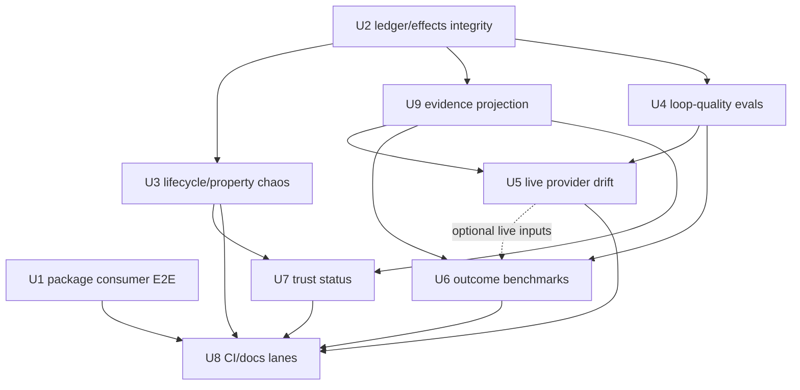

# feat: Add Vernier deep eval suite

## Summary

Build Vernier's deep evaluation suite across all six requested tracks: deterministic release/package proof, chaos and invariant hardening, loop-quality review, live provider drift checks, agent outcome benchmarks, and ledger-backed trust status. This is an umbrella/coordinator plan: Phase 1 is the first implementation handoff, while later provider, benchmark, and trust slices should start only after the deterministic evidence substrate is stable.

---

## Problem Frame

Vernier's public promise is not just that tests pass; it is that typed loops can run through swappable executors while effects, contracts, decisions, usage, and recovery evidence are durably inspectable from the append-only ledger. The repo already has strong deterministic tests and an active release-confidence plan, but a deep eval program needs a durable structure for all six evaluation concepts rather than mixing release confidence, live-provider drift, outcome quality, and trust promotion into one undifferentiated test bucket.

The key risk is false confidence: a source-lane unit suite can pass while the packed package is broken, a live provider demo can pass while loop data is structurally weak, and a trust gate can promote from bad evidence if ledger corruption or unknown effects are not already fail-closed.

### Implementation Handoff Slice

This plan coordinates the full deep-eval program. Before Phase 1 implementation starts, resolve the release-confidence baseline ambiguity in `docs/plans/2026-06-17-003-fix-testing-release-confidence-plan.md`. The implementer must have one concrete baseline input: a commit SHA, PR URL, branch name, or an explicit note that the release-confidence plan has not landed and must be implemented first. Until that reference exists, U1-U3 in this plan are coordination targets rather than a clean implementation handoff.

Once the baseline is pinned, the first implementation handoff should cover only Phase 1 unless Tyler explicitly expands scope:

- U1 installed-package consumer E2E.
- U2 ledger/effects integrity semantics.
- U3 bounded lifecycle/subprocess/property chaos.
- U8a only where needed to expose the deterministic U1/U3 lanes through local scripts, CI naming, and minimal docs. Live-provider, benchmark, and trust-status docs remain follow-up U8 work.

U4-U9 are sequenced follow-up slices and should not be implemented opportunistically during Phase 1 except where a Phase 1 unit needs a narrow evidence-shape or docs/CI reference to avoid rework.

Phase 1 should be decomposed into reviewable sub-handoffs rather than one sprawling PR:

- Phase 1a: U1 installed-package smoke only.
- Phase 1b: U2 journal integrity characterization and fail-closed semantics.
- Phase 1c: U2 effect-observer unknown-effects propagation.
- Phase 1d: U3 subprocess JSONL direct tests.
- Phase 1e: U3 process/lease chaos after U2 semantics are pinned.
- Phase 1f: property tests only after deterministic examples define each invariant.

---

## Requirements

- R1. Prove the installed package path end-to-end from a clean consumer project: pack/install, scaffold `smoke`, discover loops, run a deterministic loop, and inspect the resulting ledger.
- R2. Keep default PR checks deterministic, offline, and auth-free; live provider calls must stay behind explicit environment gates.
- R3. Define and test current `loop-v2` journal integrity semantics before process chaos, provider benchmarks, or trust decisions consume ledger evidence.
- R4. Prove effect observation fails loud for adversarial filesystem and observer-failure cases instead of silently reporting clean state.
- R5. Characterize process, lease, and subprocess lifecycle behavior under real aborts, stale leases, malformed JSONL streams, and bounded-output failures.
- R6. Add property/state-machine tests only for invariants grounded in documented contracts, example tests, or explicit compatibility decisions.
- R7. Add deterministic loop-quality evals for shipped templates and malformed fixture loops using enforceable contracts, effects, and ledger evidence rather than skill text alone.
- R8. Add an opt-in live provider drift matrix that records provider availability, version/config evidence where available, structured-output behavior, write posture, evidence artifacts, usage, and effect attribution.
- R9. Add agent outcome benchmarks for template loops with stable datasets, deterministic harness tests, live-provider variance reporting, and ledger-derived metrics.
- R10. Add a read-only ledger-backed trust status gate after ledger/effects/process semantics are stable; defer config mutation or promotion writes until status output is reliable.
- R11. Separate source, dist/package, chaos, live provider, benchmark, and trust evidence lanes so each failure answers a specific question.
- R12. Preserve Vernier's core invariants: loop data stays provider-neutral, provider quirks stay in executors, policy remains pure, and the ledger remains the source of truth.

---

## Scope Boundaries

- Do not add live provider calls to default `npm test` or normal PR CI.
- Do not publish to npm, create a release, or add release side effects.
- Do not change Vernier's core model: Loop = Signature + Steps + Policy + Trust + Ledger; Step = Signature + Executor + Contract + Effects.
- Do not treat provider sandboxing as Vernier's portable proof. The portable proof remains post-run effect observation, ledgered evidence, and policy escalation.
- Do not implement trust promotion mutation as part of the first trust-gate slice. Start with read-only trust status over ledgers.
- Do not imply Windows support unless a later implementation deliberately adds and verifies it.
- Do not treat skill instructions as enforcement. Behaviors that matter must be expressed as contracts, effects, typed outputs, policy decisions, or ledger checks.

### Deferred to Follow-Up Work

- High-repeat nightly stress beyond the deterministic seeded chaos set: add after PR-tier lifecycle tests are stable.
- Config mutation for `trust promote`: defer until read-only trust status is stable; when added, prefer preview-first behavior and avoid unsafe JS/TS config mutation.
- Expanding live-provider benchmarks into a public scoreboard: defer until result schema, cost controls, and variance policy are proven locally.
- Documentation consistency cleanup for stale `HANDOFF.md` and `skills/evaluating-vernier-loops/SKILL.md` wording: include only where touched by eval work; broader doc refresh can be separate.

---

## Context & Research

### Relevant Code and Patterns

- `package.json` defines source, build, package smoke, and verify scripts; `vitest.config.ts` aliases `vernier` to `src/index.ts`, so normal Vitest coverage is source-lane proof rather than installed-package proof.
- `scripts/package-smoke.mjs` currently packs, installs into a temp consumer, checks required files, runs installed help, and imports the public API. It does not yet run a scaffolded installed loop.
- `.github/workflows/ci.yml` currently runs one source/package verification lane on Node 22.
- `bin/vernier.js` prefers built `dist/` when present and falls back to source through `tsx` in development checkouts, making source-vs-dist proof a release-critical distinction.
- `src/engine/tick.ts` owns the interpreter boundary: validate input, snapshot effects, run executor, assess effects, validate output/contract, journal entries, and call pure policy.
- `src/engine/resume.ts` rebuilds runs by ledger replay, not executor re-execution.
- `src/ledger/ledger.ts` defines append-only JSONL, `loop-v2` resume keys, journal loading, replay maps, and safe journal path handling.
- `src/kernel/effects.ts` and `src/kernel/git-effects.ts` implement post-run effect attribution.
- `src/engine/lease.ts`, `src/cli/main.ts`, and `src/executors/vendor/omegacode/subprocess-jsonl.ts` are the lifecycle and process-control seams for chaos evals.
- `templates/smoke/**`, `templates/coding-review/**`, `templates/verified-answer/**`, and `templates/self-improving/**` are the shipped loop fixtures that should become loop-quality and benchmark baselines.
- `test/*-template.test.ts` files already prove deterministic template behavior; `test/*.live.test.ts` files already establish the opt-in live-test pattern.
- `docs/plans/2026-06-17-003-fix-testing-release-confidence-plan.md` is the closest prior plan for release confidence and should be treated as the baseline for package, chaos, lifecycle, CI, and property work.
- `docs/plans/2026-06-17-002-feat-trust-promotion-gate-plan.md` is the prior plan for ledger-backed trust status/promotion and should be consumed rather than re-invented.

### Institutional Learnings

- `docs/solutions/` does not exist in this checkout.
- Vernier's core dogma is repeated in `README.md`, `HANDOFF.md`, `docs/walkthrough.md`, and repo-local skills: loop as data, step typed, executor fungible, policy pure, ledger append-only.
- Default tests are expected to stay deterministic and auth-free; provider live runs are reserved for deliberate proof and drift checks.
- Prior plans emphasize real temp directories, spawned CLI processes, PATH shims, scripted fake workers, exact ledger inspection, and surgical journal edits rather than mocks that bypass Vernier's actual boundaries.
- `HANDOFF.md` contains stale rough-edge wording about assumed-clean torn effects, while `docs/safety.md` records the newer fail-loud unknown-effects posture. New evals should follow `docs/safety.md` and current code, not stale handoff text.
- `skills/evaluating-vernier-loops/SKILL.md` appears stale about Cursor write-scope support; current provider docs and safety docs say `cursor-agent` supports workspace-write with Vernier post-run exact-scope enforcement.

### External References

- External web research was skipped. The work is governed by repo-local runtime contracts, prior plans, and test harnesses rather than an external API or framework choice.

---

## Key Technical Decisions

| Decision | Rationale |
|---|---|
| Treat release confidence and agent quality as separate tracks | Package/kernel safety must be deterministic and auth-free; agent quality is credentialed, variable, and better interpreted after the deterministic evidence layer is trusted. |
| Use ledger evidence as the common eval substrate | Vernier's product claim centers on journaled facts. Release tests, loop-quality checks, benchmarks, and trust status should derive from `journal.jsonl` rather than provider self-report; tolerant display rollups must not become strict trust oracles by accident. |
| Expand package smoke before adding broader benchmarks | A broken installed consumer path invalidates public consumption regardless of live provider behavior. This is the highest-leverage first slice. |
| Define current `loop-v2` integrity before lifecycle chaos and trust status | Process/recovery tests and trust decisions depend on knowing which journal prefixes are resumable, corrupt, legacy-compatible, or fail-closed. |
| Keep provider drift opt-in and diagnostic-rich | Live CLIs are versioned, credentialed, model-dependent, and expensive. They should record enough context to diagnose drift but not block default PRs. |
| Add loop-quality evals before live outcome benchmarks | Templates should be structurally sound and provider-neutral before spending live tokens to benchmark their behavior. |
| Start trust work with read-only status | Promotion mutation is riskier than evidence evaluation. A pure/read-only trust status command can mature the evidence contract first. |
| Introduce one shared evidence projection before live/benchmark/trust consumers diverge | Provider drift, benchmark reports, and trust status need compatible run metadata and degradation categories, but trust must consume a strict view while display stats can stay tolerant. |

### Complexity Budget and Graduation Triggers

- **Smallest viable substrate:** U1-U3 plus U8a, the minimum deterministic docs/CI/script slice needed to expose package and chaos/property lanes. This proves the package, ledger/effects, and lifecycle claims without live credentials or benchmark infrastructure.
- **Default-lane budget:** Before U3/U8 land in default or PR-visible checks, define script names, include/exclude globs, timeout ceilings, seed/repeat policy, target wall-clock budget, and which checks are blocking PR versus manual/nightly. Process-death and watchdog tests must use deterministic barriers and bounded waits; high-repeat stress stays out of the PR lane.
- **Provider-drift graduation trigger:** Start U5 only after loop-quality checks in U4 can distinguish template defects from provider adapter drift. Stop at Tier 1 if availability/version/no-effects coverage already exposes provider setup drift; do not expand to write/out-of-scope tiers until the prior tier is stable.
- **Benchmark graduation trigger:** Start U6 with fake-backed fixtures only. Add live benchmarks only after U5 provider drift passes for the target provider and the fake-backed report schema has at least one passing and one failing fixture.
- **Trust graduation trigger:** Start U7 only after U2/U3 establish strict current-v2 evidence semantics and U9 exposes unsafe/degraded evidence without hiding it behind tolerant stats summaries.
- **Exit path:** If any track starts requiring broad product decisions, publishing side effects, config mutation, or ongoing hosted infrastructure, stop that track and split a follow-up plan instead of expanding this one.
- **Unit ordering note:** Unit numbers preserve the six-concept grouping and later-added shared evidence work; implementation order is governed by dependencies and the phased delivery section, not numeric order.

---

## Open Questions

### Resolved During Planning

- Should the plan update the existing release-confidence plan or create a new plan? Create a new all-six plan. `docs/plans/2026-06-17-003-fix-testing-release-confidence-plan.md` remains the detailed baseline for deterministic release-confidence hardening, while this plan coordinates all six eval tracks.
- Should live provider checks enter the default release gate? No. They remain opt-in/nightly or manually invoked because they require credentials, can drift with provider versions, and may spend tokens.
- Should trust promotion mutation be included? No for the first trust slice. Read-only trust status is in scope; config mutation is deferred.
- Should property tests be mandatory everywhere? No. They should be added where invariants are grounded in documented contracts or example tests; otherwise use explicit `Property test expectation: none`.

### Deferred to Implementation

- Exact package-smoke diagnostics and JSON field names: defer to implementation so the script can match current CLI output shapes without over-specifying here.
- Exact property-testing library versus small seeded generator harness: implementation should choose the lowest-friction approach after confirming runtime budget and dependency posture.
- Exact provider version capture method for every CLI: defer per provider because binaries expose version/config differently.
- Exact trust evidence window size: start from the prior plan's default proposal of three recent successful runs, but keep it configurable and verify against real ledgers.
- Exact benchmark thresholds for live providers: define initial thresholds after deterministic harness output exists and a small baseline run is available.

---

## High-Level Technical Design

> *This illustrates the intended approach and is directional guidance for review, not implementation specification. The implementing agent should treat it as context, not code to reproduce.*

The dependencies are intentionally conservative without blocking pure/read-only work behind live providers: deterministic package and journal/effects semantics land before broader gates consume their evidence; U9 normalizes shared evidence before provider drift, benchmarks, and trust status diverge; U7 reads stable ledger evidence and does not wait for live benchmarks. U8 is incremental: U8a can land with U1/U3 for deterministic lane visibility, while trust/live/benchmark docs wait for their owning units.

---

## Implementation Units

### U1. Expand installed-package consumer E2E

**Goal:** Prove a packed Vernier artifact can install into a clean consumer project, scaffold and run the deterministic `smoke` template, and inspect the same run ledger through installed CLI commands.

**Requirements:** R1, R2, R11

**Dependencies:** None

**Files:**
- Modify: `scripts/package-smoke.mjs`
- Modify: `package.json` if script separation is needed
- Test/reference: `templates/smoke/**`
- Test/reference: `test/walkthrough.test.ts`
- Test/reference: `test/smoke-template.test.ts`

**Approach:**
- Keep the existing pack/install/import checks, but extend the consumer temp-project flow into the real public path: scaffold `smoke`, discover loops, run `control-plane-smoke-test`, render/show the run, and roll up stats from the produced ledger.
- Make the build/pack freshness contract explicit. Either rebuild/delete `dist` inside package smoke, run `npm pack` with the intended lifecycle in a controlled way, or require CI to build immediately before pack and assert the packed artifact corresponds to current source output. Do not let a stale `dist` directory produce a false package proof.
- Isolate cwd, `VERNIER_HOME`, `VERNIER_CONFIG`, package resolution, and temp directories so the smoke cannot accidentally use checkout-local `src`, `tsx`, repo `node_modules`, or repo `.vernier` state.
- Make the smoke fail with concise package diagnostics when required package files, executable bin behavior, templates, exports, or dependency-lending behavior are broken.
- Treat source-lane Vitest success and installed-package success as different evidence types; package smoke should prove built `dist` and packed templates.
- Ownership note: detailed implementation authority for the deterministic release-confidence slice remains `docs/plans/2026-06-17-003-fix-testing-release-confidence-plan.md`. If this plan and that plan conflict for U1-U3, update the release-confidence plan first and mirror only dependency/coordination changes here.

**Execution note:** Start with a failing package smoke assertion that requires a real installed `smoke` run, then deepen until the installed consumer lifecycle passes.

**Patterns to follow:**
- `scripts/package-smoke.mjs` for temp consumer install and concise diagnostics.
- `test/walkthrough.test.ts` for end-to-end smoke template expectations.
- `templates/smoke/smoke-loop.mjs` for no-auth deterministic loop behavior.

**Test scenarios:**
- Happy path: packed tarball installs into a blank temp consumer; installed CLI scaffolds `smoke`; installed CLI runs `control-plane-smoke-test`; run status is successful and ledger exists under isolated `VERNIER_HOME`.
- Integration: `loops --json`, `run --json`, `show --json`, and `stats --json` all refer to the same consumer-owned loop/run evidence.
- Error path: missing packed `dist`, `bin`, docs, or `templates` files fails package smoke before giving a misleading success.
- Error path: installed CLI accidentally relies on checkout-local source or dev dependencies; smoke fails in the clean consumer.
- Edge case: consumer directory path contains spaces or unusual safe path characters and template import resolution still succeeds.
- Edge case: scaffold target has a conflicting file and `init smoke` fails without partial overwrite.

**Property test expectation:** none -- this unit is an installed-package integration smoke rather than a pure invariant surface.

**Verification:**
- Package smoke proves real installed use, not only help text and public exports.
- Package smoke cannot pass from stale built artifacts without proving the current package output.
- Default package smoke remains deterministic, auth-free, and suitable for CI.

### U2. Pin ledger and effect-observation integrity semantics

**Goal:** Define and test the fail-closed semantics for current `loop-v2` journals and effect observation, including observer failure and crash-window recovery.

**Requirements:** R3, R4, R6, R12

**Dependencies:** None

**Files:**
- Modify: `test/ledger.test.ts`
- Modify: `test/resume.test.ts`
- Modify: `test/effects.test.ts`
- Modify: `test/git-effects.test.ts`
- Modify: `test/tick.test.ts`
- Modify: `src/ledger/ledger.ts` only if tests expose unvalidated current-format corruption
- Modify: `src/engine/resume.ts` only if tests expose unsafe replay behavior
- Modify: `src/engine/tick.ts` only if tests expose missing unknown-effects propagation
- Modify: `src/kernel/effects.ts` only if tests expose silent-clean observation gaps
- Modify: `src/kernel/git-effects.ts` only if tests expose git/hash attribution gaps

**Approach:**
- Separate acceptable crash prefixes from current-format corruption. A torn trailing JSON line may remain compatible; malformed non-tail entries, missing required current-v2 fields, orphan decisions, key mismatches, and duplicate/conflicting terminal entries should fail closed.
- Add full-engine tests for observer failure and `observed: false` so unknown effects reach the ledger and policy escalates rather than being summarized as clean.
- Make adversarial filesystem fixtures explicit: symlinks, non-regular files, deletes, permission failures where feasible, ignored files, hard links where feasible, and prefix-boundary path matching.
- Record capability-dependent filesystem cases individually so unsupported OS/filesystem features do not mask unrelated coverage.
- Keep sub-slices reviewable: journal schema/integrity, effect observer adversarial cases, and full-engine unknown-effects propagation can land separately even though this umbrella unit coordinates them.

**Execution note:** Use characterization-first tests for current behavior, then change runtime behavior only where it contradicts `docs/safety.md` or the current release-confidence plan.

**Patterns to follow:**
- `test/resume.test.ts` for surgical journal edits and crash-window characterization.
- `test/effects.test.ts` and `test/git-effects.test.ts` for direct observer tests.
- `docs/safety.md` for the fail-loud unknown-effects contract.

**Test scenarios:**
- Happy path: complete current-v2 journal replays without executor re-execution and reaches the same terminal state.
- Error path: invalid JSON before later valid entries fails closed with a clear journal diagnostic.
- Error path: malformed-but-parseable current-v2 entry with missing required fields fails closed rather than being cast as trusted evidence.
- Error path: crash after `step_started` but before terminal result resumes into interrupted/unknown evidence and escalates.
- Error path: crash after `step_result` but before effects records unknown effects and escalates rather than assuming clean scope.
- Integration: observer failure during `tick()` produces an `effects` ledger entry with unobserved/unknown state and a human-needed decision.
- Edge case: `dir/**` scope matches nested files under `dir` but not sibling prefixes such as `dir2`.
- Edge case: symlink or non-regular trace/effect target is rejected or reported unknown rather than silently clean.
- Edge case: ignored files in a git workdir are still attributed when they change under relevant scopes.

**Property candidates:**
- P1. Current-v2 replay is idempotent for valid complete journals.
  - Source of truth: `loop-v2` resume design and existing resume tests.
  - Example anchor: a multi-step journal with completed result/effects/decision entries replays to the same state without executor calls.
  - Generator/input domain: small valid journal prefixes over known loop fixtures.
  - Oracle: repeated resume does not append duplicate repair entries and returns the same state.
  - Failure meaning: replay is not pure over ledger facts or crash repair is not idempotent.
  - Tier: fast PR after deterministic examples land.
- P2. Path-scope matching does not overmatch siblings.
  - Source of truth: `EffectScope` docs and existing exact/`dir/**` semantics.
  - Example anchor: `dir/**` accepts `dir/file` and rejects `dir2/file`.
  - Generator/input domain: safe relative path segments with shared prefixes.
  - Oracle: exact patterns only match exact paths; prefix patterns only match descendants.
  - Failure meaning: effect scopes can silently allow unintended paths.
  - Tier: fast PR.

**Verification:**
- Current journal corruption classes are explicit and fail closed.
- Unknown or unobserved effects cannot produce a successful run decision.
- Adversarial filesystem changes are attributed, rejected, or escalated; none silently disappear.

### U3. Add process, lease, subprocess, and property chaos lanes

**Goal:** Exercise Vernier's runtime lifecycle under real process death, lease contention, JSONL subprocess failure, and seeded state-machine invariants without relying on live provider CLIs.

**Requirements:** R5, R6, R11

**Dependencies:** Split by sub-slice. Subprocess JSONL helper tests can start without U2; process death/resume waits on U2 journal semantics; each property test depends on deterministic examples for that invariant.

**Files:**
- Create: `test/process-lifecycle.test.ts`
- Create: `test/subprocess-jsonl.test.ts`
- Create: `test/properties.test.ts` or an equivalent scoped property test file
- Modify: `test/lease.test.ts`
- Modify: `test/cli.test.ts`
- Modify: `src/engine/lease.ts` only if tests expose behavior that contradicts documented lease semantics
- Modify: `src/cli/main.ts` only if real process tests expose shutdown or signal gaps
- Modify: `src/executors/vendor/omegacode/subprocess-jsonl.ts` only if direct tests expose lifecycle bugs

**Approach:**
- Use deterministic fake providers, child processes, barriers, and temp workdirs to test real OS process behavior without network or credentials.
- Split active lease contention from stale-takeover characterization so default tests only block on guarantees Vernier actually claims.
- Test subprocess JSONL mechanics directly at the shared helper: framing, non-JSON diagnostics, parse failure handling, abort, watchdog, stderr bounding, spawn failure, and settle-once races.
- Add seeded properties for pure invariants after example tests define the source of truth. Counterexamples that reveal real defects should become deterministic regression examples.
- Keep sub-slices reviewable: direct subprocess JSONL tests can start independently; process death/resume waits on U2 journal semantics; lease/race characterization waits on process lifecycle; property tests are staged per invariant source.
- Define lane controls before adding U3 checks to default runs: package script name, test globs, per-test timeout ceilings, seed/repeat policy, target wall-clock budget, and PR-blocking versus manual/nightly status.

**Execution note:** Keep PR-tier chaos bounded and reproducible. High-repeat stress belongs to a later nightly lane, not the first default test set.

**Patterns to follow:**
- `test/lease.test.ts` for current lease semantics.
- `test/cli.test.ts` for spawned CLI process patterns.
- `test/cursor-worker.test.ts` for scripted worker/subprocess-style tests.
- `src/executors/vendor/omegacode/subprocess-jsonl.ts` for shared child process mechanics.

**Test scenarios:**
- Happy path: one driver holds a lease and advances a run; a second active contender fails without appending journal entries.
- Error path: stale lease takeover is characterized with bounded deterministic timing and does not claim adversarial safety unless hardened.
- Error path: SIGTERM/SIGINT/SIGKILL during an active run leaves a resumable or fail-closed journal prefix according to U2 semantics.
- Error path: subprocess emits malformed JSONL after valid lines; helper fails loudly without double-settling.
- Error path: subprocess stalls with no stdout progress; watchdog aborts and records retryable stall behavior.
- Edge case: huge stderr is bounded and diagnostic tail remains useful.
- Edge case: abort races with process close; result settles exactly once.
- Integration: resumed run after process death does not re-execute a completed side-effecting slot.

**Property candidates:**
- P1. `resumeKey` is stable for canonical-equivalent input records.
  - Source of truth: documented canonical key design in `src/ledger/ledger.ts`.
  - Example anchor: reordered object keys produce the same key.
  - Generator/input domain: JSON-compatible records without unsupported values, plus explicit regression examples for special values if accepted.
  - Oracle: canonical-equivalent values produce equal keys; different step/iteration/attempt values produce distinct keys.
  - Failure meaning: replay can collide or miss completed slots.
  - Tier: fast PR.
- P2. Pure policy state transitions preserve terminal state invariants.
  - Source of truth: `retryPolicy`, `until`, and `nextState` tests.
  - Example anchor: retry increments attempt, iterate increments iteration and resets attempt, stop/escalate terminalizes.
  - Generator/input domain: valid observations/decisions grounded in existing policy tests.
  - Oracle: terminal states are not tickable; retry/iterate/continue move only to valid step indices.
  - Failure meaning: policy replay can produce impossible run states.
  - Tier: fast PR after examples land.

**Verification:**
- Process and subprocess failures are bounded, deterministic, and classified.
- Lease behavior is characterized without overstating concurrency guarantees.
- Property tests emit replayable seeds/counterexamples and have deterministic regression follow-up for true defects.

### U9. Define shared run-evidence projection

**Goal:** Define the normalized evidence envelope that provider drift, benchmark reports, and trust status consume without making tolerant display stats the strict trust oracle.

**Requirements:** R3, R4, R8, R9, R10, R11, R12

**Dependencies:** U2

**Files:**
- Create or modify: `src/ledger/evidence.ts` if implementation chooses a dedicated helper
- Modify/reference: `src/ledger/stats.ts`
- Modify/reference: `src/ledger/ledger.ts`
- Create or modify: `test/evidence-projection.test.ts`
- Reference: `test/stats.test.ts`

**Approach:**
- Define a small normalized projection over run ledgers that can represent success, failure, degraded/unknown effects, current-v2 corruption, legacy incompatibility, missing usage, and provider metadata without hiding evidence gaps.
- Keep two views conceptually distinct: tolerant display summaries may degrade gracefully for `show`/`stats`, while trust status must consume strict validated current-v2 evidence or explicit degraded states.
- Version the evidence contract before downstream consumers depend on it: include `schemaVersion`, required versus optional fields, golden fixtures, and compatibility expectations for strict trust consumers versus tolerant display/report consumers.
- Minimum evidence fields should cover loop id/version, run id, executor/provider id, provider version/config when known, ledger path, terminal status, output validity, contract status, effect status, degraded/corrupt state, usage/cost honesty, timestamps/duration, and evidence/artifact references.
- Include redaction/privacy rules for reports so live-provider artifacts and benchmark summaries do not accidentally publish prompt, transcript, local absolute path, or credential-adjacent data.
- If provider drift or benchmark reports are written to disk, write them only under a documented ignored/generated path such as `eval/reports/` or a temp output path. Require `.gitignore` coverage, no absolute local paths by default, explicit opt-in for CI upload, and redaction checks for files and console output.

**Patterns to follow:**
- `src/ledger/stats.ts` for pure derivation over ledgers.
- `test/stats.test.ts` for summary fixture style.
- `docs/safety.md` for effect and evidence boundaries.

**Test scenarios:**
- Happy path: clean completed journal projects to success evidence with valid output, passed contracts, observed allowed effects, and usage/duration when present.
- Error path: current-v2 corruption projects to strict invalid evidence for trust consumers rather than being skipped as display noise.
- Error path: missing effects or `observed: false` projects to degraded/unknown evidence.
- Edge case: missing provider usage is represented as unavailable/zero according to source facts, not fabricated cost.
- Integration: benchmark and trust-status fixture tests can consume the same projection while applying different thresholds.
- Integration: readers reject or explicitly degrade unknown `schemaVersion` values instead of silently treating them as trusted evidence.

**Property candidates:**
- P1. Evidence projection preserves unsafe flags.
  - Source of truth: `docs/safety.md` and trust evidence requirements.
  - Example anchor: a journal with unexpected effects projects to non-promotable evidence.
  - Generator/input domain: small ledger evidence summaries with boolean safety flags.
  - Oracle: corruption, unknown effects, failed contracts, bad output, and escalation remain visible in the projection.
  - Failure meaning: downstream trust/benchmark consumers can accidentally hide unsafe evidence.
  - Tier: fast PR if projection is a pure helper.

**Verification:**
- Provider drift, benchmark, and trust work have one compatible evidence vocabulary.
- Strict trust evaluation cannot accidentally inherit tolerant display behavior from stats summaries.

### U4. Add deterministic loop-quality evals

**Goal:** Evaluate shipped and malformed loop definitions through a reusable deterministic quality evaluator/report for structural soundness: typed boundaries, contract coverage, effect minimality, provider-neutrality, policy termination, retry feedback, skill wiring, and trust-marker honesty.

**Requirements:** R7, R12

**Dependencies:** U2

**Files:**
- Create: `test/loop-quality.test.ts`
- Create or modify: `src/kernel/loop-quality.ts` only if implementation introduces a reusable pure evaluator instead of test-local helpers
- Create fixtures under `test/fixtures/loop-quality/` if fixture modules are needed
- Modify/reference: `templates/smoke/smoke-loop.mjs`
- Modify/reference: `templates/coding-review/coding-review-loop.mjs`
- Modify/reference: `templates/verified-answer/verified-answer-loop.mjs`
- Modify/reference: `templates/self-improving/self-improving-loop.mjs`
- Reference: `skills/evaluating-vernier-loops/SKILL.md`
- Reference: `test/*-template.test.ts`

**Approach:**
- Treat `skills/evaluating-vernier-loops/SKILL.md` as review rubric input, not enforcement. Convert the enforceable portions into deterministic loop-quality fixture checks and classify advisory-only findings separately from hard failures.
- Define hard rules with stable rule IDs, severity/pass/fail semantics, and the source of truth for each rule. Each hard rule should have at least one expected-fail fixture; advisory rules should stay visibly non-blocking.
- Add expected-pass checks for shipped templates and expected-fail checks for malformed fixtures.
- Cover both static loop data properties and behavior through deterministic fake/script executors where runtime evidence is required. Prefer a small pure evaluator/report with stable pass/fail/warn categories over hard-coding all quality logic inside one test file, and have the report show which rule IDs each shipped template and malformed fixture exercised.
- Include stale-skill caveat: provider write support should follow current provider docs and safety docs, especially Cursor workspace-write behavior.

**Patterns to follow:**
- Existing template tests for loading and running scaffolded loop modules.
- `test/doctor.test.ts` for diagnostics around missing/unrunnable bindings.
- `test/skills-delivery.test.ts` and `test/skills-cli.test.ts` for skill resolution expectations.

**Test scenarios:**
- Happy path: each shipped template passes loop-quality checks for typed boundaries, provider-neutral role naming, bounded policy, and declared effects/contracts.
- Happy path: retrying or iterating template prompts include retry/feedback context so second attempts can change behavior.
- Error path: LLM step with no contract and no downstream verifier is rejected by loop-quality eval.
- Error path: uncapped iterate loop is rejected.
- Error path: overbroad effect scope is flagged unless the fixture explicitly documents why it is acceptable.
- Error path: provider name embedded in loop data where a role binding belongs is flagged.
- Error path: skill-bearing promptless step fails before run-time ambiguity.
- Integration: route rejection in `coding-review` does not run the write-scoped worker.
- Integration: `self-improving` cannot remember a rule unless the grade path passed.

**Property candidates:**
- P1. Loop-quality static checks are monotonic over fixture mutations that remove safeguards.
  - Source of truth: evaluating-vernier-loops rubric converted into deterministic expectations.
  - Example anchor: a fixture with no contract fails; adding the contract restores pass when other requirements are met.
  - Generator/input domain: small fixture mutations around contracts/effects/policy caps where practical.
  - Oracle: removing a required safeguard cannot improve the quality result.
  - Failure meaning: loop-quality scoring has inconsistent or tautological rules.
  - Tier: regression-only unless implementation keeps generation simple.
  - First-slice expectation: deterministic example tests only; add this property only if a pure evaluator makes it simpler than equivalent fixture examples.

**Verification:**
- Shipped templates have deterministic structural eval coverage independent of live provider behavior.
- Malformed fixtures fail for clear reasons that match the loop-quality rubric.

### U5. Add opt-in live provider drift matrix

**Goal:** Turn existing live tests into a coherent provider drift matrix that verifies current adapter posture and captures enough evidence to diagnose provider CLI/model changes over time.

**Requirements:** R2, R8, R11, R12

**Dependencies:** U4, U9

**Files:**
- Modify: `test/provider-live.test.ts`
- Modify: `test/claude.live.test.ts`
- Modify: `test/opencode.live.test.ts`
- Modify: `test/pi.live.test.ts`
- Modify: `test/coding-review.live.test.ts`
- Modify: `test/verified-answer.live.test.ts`
- Modify: `test/self-improving.live.test.ts`
- Modify/reference: `docs/provider-executors.md`
- Modify/reference: `docs/safety.md`
- Modify/reference: `src/executors/codex.ts`
- Modify/reference: `src/executors/claude.ts`
- Modify/reference: `src/executors/cursor.ts`
- Modify/reference: `src/executors/opencode.ts`
- Modify/reference: `src/executors/pi.ts`
- Modify/reference: `src/executors/judge.ts`

**Approach:**
- Define matrix dimensions by provider capability rather than by template demo: availability, version/config evidence where available, no-effects step, structured output if claimed, write-scope support or fail-closed behavior, evidence artifacts, usage reporting, timeout/abort posture, and out-of-scope write escalation where feasible.
- Start with a shared live-provider test harness that centralizes requested-vs-available behavior, binary/auth/config probes, provider version/config capture, timeout defaults, redaction, isolated `VERNIER_HOME`/`VERNIER_CONFIG`, and actionable failure diagnostics. Existing live tests should use this harness before the matrix expands.
- Run provider CLIs with an explicit minimized environment where feasible: env allowlist, isolated `HOME`/config/cache, documented credential variable names per provider, and redaction tests that cover env/config-derived values. Provider-specific exceptions must be documented as manual/local-only when isolation is not practical.
- Stage the matrix by budget: Tier 1 availability/version/config capture plus no-effects step per provider; Tier 2 structured output only where claimed; Tier 3 write-scope proof only for supported write providers; Tier 4 explicitly gated out-of-scope write escalation.
- Preserve the current explicit env-gate model and split skip/fail semantics: gate absent means skip; gate present with missing binary/auth/config means fail with an actionable diagnostic; gate present and provider available means run. Existing tests that combine request and availability into a skip should be refactored.
- Bound live runs with explicit timeout, token/cost, sample-count, retry, artifact redaction, and isolated temp-workdir expectations before adding more provider/template combinations. Label each live lane as diagnostic-only or blocking; default live lanes should be diagnostic unless a later plan explicitly promotes them.
- Tier 4 out-of-scope write escalation requires an additional destructive/out-of-scope env gate, a sacrificial temp root with no repo/user-home access, fake target paths, explicit allow/deny path assertions, isolated HOME/config/cache, and post-run verification that no path outside the sacrificial root changed.
- Record provider drift output in a stable JSON or ledger-derived report so one live run can be compared with later runs.
- Keep provider-specific work inside executor tests and docs; do not special-case kernel/engine behavior for provider quirks.

**Patterns to follow:**
- Existing live env gating in `test/*.live.test.ts`.
- `vernier doctor --json` style for capability diagnostics.
- `docs/provider-executors.md` for provider-specific posture claims.

**Test scenarios:**
- Happy path: gated Codex live run completes read-only value step and write-scoped template flow without unexpected effects.
- Happy path: gated Claude live run completes read-only step and, where configured, structured-output judge path.
- Happy path: gated Cursor live run proves read-only and workspace-write posture, including out-of-scope escalation behind the explicit out-of-scope gate.
- Error path: opencode/pi write-scoped binding fails closed rather than running unconfined write work.
- Error path: provider emits malformed structured output; executor reports failure and policy retries/escalates rather than crashing.
- Error path: env gate is set but provider binary/auth is unavailable; test fails with diagnostic rather than silently skipping.
- Edge case: provider exits successfully with refusal or non-answer text; structured/contract validation catches the bad result.
- Edge case: provider usage fields are absent or changed; drift report records honest missing/zero/unknown values without fabricating cost.

**Property test expectation:** none -- provider drift is live integration behavior and should be measured with explicit examples and ledger facts.

**Verification:**
- Live drift tests remain outside default PR checks.
- A single command/env-gated matrix can report provider capability drift without conflating it with template outcome quality.

### U6. Add agent outcome benchmark harness

**Goal:** Benchmark Vernier's template loops across deterministic fake providers and opt-in live providers using versioned datasets, stable ledger-derived metrics, and explicit variance/cost reporting.

**Requirements:** R2, R9, R11

**Dependencies:** U4, U9. Optional live-provider benchmark execution depends on U5, but the deterministic fake-backed harness does not.

**Files:**
- Create: `test/benchmark-harness.test.ts`
- Create: `eval/benchmarks/fixtures/` for versioned deterministic benchmark cases if implementation introduces file-backed fixtures
- Create: `eval/reports/` only for ignored/generated local reports if reports are written to disk
- Modify/reference: `src/ledger/stats.ts`
- Modify/reference: `templates/coding-review/**`
- Modify/reference: `templates/verified-answer/**`
- Modify/reference: `templates/self-improving/**`
- Modify/reference: `test/coding-review-template.test.ts`
- Modify/reference: `test/verified-answer-template.test.ts`
- Modify/reference: `test/self-improving-template.test.ts`

**Approach:**
- Start with deterministic fake-backed benchmark cases that prove the harness, scoring, report schema, and ledger extraction without live providers. Live-provider benchmark execution is a later mode over the same schema, not a prerequisite for the harness.
- Define small versioned datasets for value-only answer loops, route-reject flows, coding artifact loops, and self-improving two-run memory flows.
- Derive metrics from the U9 evidence projection plus benchmark-specific fields: suite version, case id, terminal status, verdict, iterations, attempts per step, contract failures, unexpected effects, unobserved effects, usage, duration, cost where available, provider id/config/version where available, run id, and journal path.
- For live runs, report variance and budgets rather than treating one success as stable proof. Keep live benchmark gates separate from provider seam drift gates, and define per-provider timeout, max runs, max estimated/reported cost, required sample count for variance mode, retry policy, and diagnostic-only versus blocking status before adding live benchmark execution.
- Preserve independence between producer and judge where benchmarks rely on grading; avoid self-approval as a quality signal.

**Patterns to follow:**
- Existing deterministic template tests for controlled loop execution.
- Existing live template tests for opt-in provider behavior and variance reporting.
- `src/ledger/stats.ts` for pure rollups from ledger entries.

**Test scenarios:**
- Happy path: deterministic fake-backed verified-answer benchmark passes and report records one successful run with expected status, attempts, and ledger path.
- Happy path: deterministic fake-backed self-improving benchmark shows run 2 recalled a verified rule from run 1.
- Error path: route-reject benchmark ends in expected human-needed state and does not execute write-scoped worker.
- Error path: benchmark case with wrong artifact path fails through contract/effects evidence, not provider self-report.
- Edge case: provider usage/cost is missing; report marks it unavailable rather than inventing values.
- Integration: live benchmark runner can execute a small provider-gated subset and produce the same report schema as fake-backed runs.
- Integration: repeated live benchmark runs can be compared by provider/config/version and show variance instead of overwriting evidence.

**Property candidates:**
- P1. Benchmark report totals equal the sum of included ledger facts.
  - Source of truth: `src/ledger/stats.ts` rollup behavior and benchmark report examples.
  - Example anchor: two fixture ledgers produce exact aggregate counts for runs, successes, attempts, and unexpected effects.
  - Generator/input domain: small collections of valid synthetic ledger summaries.
  - Oracle: aggregate fields match per-run source facts and no run is counted twice.
  - Failure meaning: benchmark reporting can mislead readers about quality/cost.
  - Tier: fast PR if a pure report helper is introduced.
  - First-slice expectation: deterministic example tests only; add this property only if a pure report helper makes it simpler than equivalent fixture examples.

**Verification:**
- Benchmark harness can run deterministically without credentials.
- Live benchmarks are opt-in and produce comparable, ledger-derived reports.
- Quality metrics are separated from provider seam availability/drift metrics.

### U7. Add read-only ledger-backed trust status

**Goal:** Add a trust status evaluator that consumes stable ledger evidence and reports whether a loop/version has enough clean evidence to be considered promotable, without mutating config.

**Requirements:** R3, R4, R5, R10, R12

**Dependencies:** U2, U3, U9

**Optional input:** Benchmark-produced ledgers from U6 may become later evidence sources, but ordinary deterministic run ledgers must be enough for trust status.

**Files:**
- Modify: `src/ledger/stats.ts` only for display plumbing, or create a focused trust evidence helper under `src/ledger/` for strict status evaluation
- Modify: `src/cli/main.ts`
- Modify/reference: `src/cli/config.ts`
- Modify/reference: `src/ledger/ledger.ts`
- Create or modify: `test/trust-status.test.ts`
- Modify/reference: `docs/plans/2026-06-17-002-feat-trust-promotion-gate-plan.md`
- Modify: `README.md` and/or `docs/safety.md` if the command is exposed publicly

**Approach:**
- Implement trust status as a pure/read-only evaluation over strict validated ledger facts grouped by loop id/version, not as a mutation of loop config and not as a thin wrapper over tolerant display stats.
- Required evidence should include terminal success, valid typed output, passed contracts where configured, observed effects, no unexpected effects, no human escalation, matching loop id/version, evidence source class, executor/provider id, provider version/config when available, fake-vs-live status, and credential/live gate status.
- Include a loop definition fingerprint or step graph hash in new evidence where feasible. Trust status should degrade or fail when only id/version is available for changed or unverifiable definitions; if content-integrity proof is deferred, label the initial output as id/version evidence only rather than full content-integrity proof.
- Add a ledger discovery/windowing surface for the CLI: enumerate configured run roots such as `VERNIER_HOME/runs/*/journal.jsonl`, load with strict current-v2 validation, sort by meta timestamp or documented fallback, filter by loop id/version/fingerprint where available, and fail or degrade explicitly on corrupt candidate evidence.
- Keep discovery inside configured run roots. Reject symlink escapes and arbitrary untrusted paths by default; if a manual `--journal` mode later accepts absolute paths, label that mode separately and keep diagnostics explicit.
- Mixed-version, corrupt current-v2 journals, legacy journals missing required evidence, unknown effects, and dirty newer runs should fail or degrade status explicitly.
- Keep the first CLI surface read-only. If future promotion mutation is added, it should be a separate unit/plan with dry-run preview and explicit write flag.
- Trust status must work over ordinary deterministic run ledgers first. Benchmark-produced ledgers are one later evidence source, not a prerequisite for the command.

**Execution note:** Implement after U2/U3 so the trust gate consumes already-defined corruption, unknown-effects, and crash-recovery semantics rather than inventing its own.

**Patterns to follow:**
- `src/ledger/stats.ts` for display-oriented summaries, while preserving a stricter trust-specific evidence path when needed.
- `src/engine/resume.ts` and `src/ledger/ledger.ts` for current journal semantics.
- `docs/plans/2026-06-17-002-feat-trust-promotion-gate-plan.md` for proposed evidence criteria.

**Test scenarios:**
- Happy path: three recent clean runs for the same loop id/version produce promotable status.
- Error path: fewer than required clean runs reports insufficient evidence.
- Error path: a newer dirty run with unexpected effects fails the current evidence window.
- Error path: clean terminal status but missing contract/effects evidence is not promotable.
- Error path: `effects.observed === false` is not promotable.
- Error path: mixed loop versions are separated; clean evidence for old version does not promote new version.
- Error path: matching id/version with a changed or unverifiable loop fingerprint degrades or fails instead of reusing stale clean evidence.
- Error path: current-v2 corruption in the evidence set fails closed.
- Error path: symlinked or out-of-root candidate journals are rejected with clear diagnostics.
- Edge case: timestamp ties or missing timestamps use documented deterministic ordering.
- Edge case: legacy/pre-v2 journals are reported as incompatible or degraded according to explicit policy, not silently treated as clean.
- Integration: CLI read command reports both human-readable and JSON trust status with the same underlying evaluation.

**Property candidates:**
- P1. Trust status is monotonic with respect to adding dirty evidence inside the evaluated window.
  - Source of truth: trust evidence criteria from the prior trust plan.
  - Example anchor: three clean runs are promotable; replacing one with unexpected effects is not promotable.
  - Generator/input domain: small windows of synthetic ledger evidence summaries.
  - Oracle: any run with unknown effects, unexpected effects, failed contract, bad output, or escalation prevents promotable status for that window.
  - Failure meaning: trust gate can promote from unsafe evidence.
  - Tier: fast PR if trust helper is pure.
  - First-slice expectation: deterministic example tests only; add this property only if a pure helper makes it simpler than equivalent fixture examples.

**Verification:**
- Trust status reads ledgers and reports evidence without mutating config.
- Unsafe, incomplete, stale, mixed-version, or corrupt evidence cannot produce promotable status.

### U8. Split CI/docs lanes and publish eval operations guidance

**Goal:** Make the deep eval suite operable by separating deterministic release gates, chaos/property gates, live provider drift, benchmarks, and trust status in CI/docs without implying unsupported guarantees.

**Requirements:** R2, R8, R9, R10, R11

**Dependencies:** Staged. Deterministic CI/docs slice depends on U1 and U3; live/benchmark operations docs depend on U5 and U6; trust docs depend on U7.

**Files:**
- Modify: `.github/workflows/ci.yml`
- Modify: `package.json`
- Modify: `README.md`
- Modify: `docs/safety.md`
- Modify: `docs/provider-executors.md`
- Modify: `docs/walkthrough.md` if command examples change
- Modify or create docs for benchmark/live eval operation if implementation chooses a separate docs file

**Approach:**
- Keep one fast deterministic PR lane for typecheck, unit/template tests, build, and installed-package smoke. Update this lane as soon as U1 lands rather than waiting for the whole eval suite; this is U8a and belongs with the deterministic handoff.
- Add a clearly named deterministic chaos/property lane once U2/U3 are stable; keep runtime budget and seed behavior documented. This docs/CI slice can land before live provider, benchmark, or trust work.
- Keep live provider drift and agent outcome benchmarks opt-in, environment-gated, and safe to run manually or on scheduled infrastructure with credentials.
- Document what each lane proves and what it does not prove: source correctness, package installability, chaos invariants, provider adapter drift, benchmark outcome quality, and trust evidence.
- Require one discoverable local command or documented env-gated command per evidence lane. Tentative command families are acceptable during implementation, but the final docs should map each confidence question to exactly one primary command: source tests, package smoke, deterministic chaos/property, live provider drift, fake-backed benchmarks, live benchmarks, and trust status.
- Update docs where they currently risk overclaiming trust, sandboxing, Cursor support, or package smoke depth.

**Patterns to follow:**
- Existing `.github/workflows/ci.yml` for current CI shape.
- Existing README Development section for concise command descriptions.
- `docs/safety.md` for safety claim boundaries.
- `docs/provider-executors.md` for provider-specific live proof gates.

**Test scenarios:**
- Integration: PR lane remains deterministic and auth-free with no live provider env gates required.
- Integration: package smoke lane proves installed consumer behavior and is distinguishable from source-lane Vitest output.
- Integration: live provider jobs skip only when gates are absent; when gates are present, provider missing/auth failure is a real failure.
- Error path: docs do not describe `active` as a proven promotion state before trust status supports that claim.
- Error path: docs do not imply Windows support or pre-write path confinement that Vernier does not provide.
- Edge case: CI lane names and package scripts make it clear whether a failure belongs to source, package, chaos, provider drift, benchmark, or trust status.

**Property test expectation:** none -- this unit is CI/docs/operations wiring around previously tested behavior.

**Verification:**
- Developers can identify which eval lane to run for a given confidence question.
- Default checks remain offline and deterministic.
- Documentation accurately distinguishes deterministic evidence, live provider evidence, benchmark evidence, and trust evidence.

---

## System-Wide Impact

- **Interaction graph:** Package smoke touches package metadata, bin resolution, templates, config discovery, ledger creation, and CLI renderers. Chaos evals touch engine, ledger, effects, lease, process, and subprocess seams. Trust status consumes strict runtime evidence; benchmark lanes may produce additional compatible evidence but are not prerequisites for read-only status.
- **Error propagation:** Observer failures, corrupt journals, subprocess stalls, provider malformed output, and lease contention must become explicit failed/degraded eval evidence rather than crashes, silent skips, or successful summaries.
- **State lifecycle risks:** Crash-window repair, run lease takeover, repeated resume, and benchmark comparisons all depend on idempotent ledger semantics.
- **API surface parity:** Human and `--json` CLI outputs should reflect the same underlying evidence for package smoke, benchmark reports, provider drift, and trust status.
- **Integration coverage:** Unit tests alone cannot prove the installed package path, real process death behavior, spawned subprocess mechanics, or provider CLI drift; those need integration tests with scoped temp dirs and explicit env gates.
- **Unchanged invariants:** Loop data remains provider-neutral; provider-specific behavior stays in executor/worker adapters; policy remains pure; live provider variance does not become default release evidence.

---

## Alternative Approaches Considered

- Expand only the existing release-confidence plan: Rejected because it covers the deterministic hardening subset well but does not cleanly own loop-quality evals, live provider drift, benchmark outcome quality, and trust status.
- Start with live provider benchmarks: Rejected because provider variability would obscure package, ledger, effects, and loop-quality defects that can be proven deterministically first.
- Implement trust promotion before trust status: Rejected because mutation is higher risk and should not happen before evidence semantics and status reporting are stable.
- Make property tests the primary confidence layer: Rejected because properties need documented/example anchors; example and contract tests should define the behavior before generators explore it.

---

## Success Metrics

- The packed package can run the deterministic `smoke` lifecycle in a clean consumer without repo-local source or dev dependencies.
- Current `loop-v2` journals have explicit pass/fail/degraded semantics for crash prefixes and corruption classes.
- Unknown or unobserved effects cannot produce a successful terminal decision.
- Lifecycle chaos tests are reproducible, bounded, and classified without live credentials.
- Shipped templates have deterministic loop-quality coverage independent of live providers.
- Live provider drift runs produce a stable evidence artifact/report and never run by default.
- Agent benchmark reports are ledger-derived and compare fake-backed and live-provider runs through the same schema.
- Trust status cannot mark a loop/version promotable from corrupt, incomplete, unknown-effects, mixed-version, or dirty evidence.

---

## Dependencies / Prerequisites

### Handoff Preconditions

Implementation must start from either a clean branch containing the release-confidence hardening baseline or an explicit commit/PR reference for the uncommitted hardening work this plan assumes. Do not begin U1-U3 from an ambiguous dirty tree. If the release-confidence baseline has not landed, implement that owning plan first or treat U1-U3 here as coordination-only.

- Existing uncommitted hardening work on the current branch should be reconciled before implementation starts; this plan was authored against a dirty working tree.
- `docs/plans/2026-06-17-003-fix-testing-release-confidence-plan.md` should be treated as active baseline context, especially for U1-U3 and CI lane sequencing.
- `docs/plans/2026-06-17-002-feat-trust-promotion-gate-plan.md` should be treated as baseline context for U7.
- Live provider lanes require local or CI credentials/binaries and explicit env gates; missing provider setup should not block deterministic implementation units.

---

## Risk Analysis & Mitigation

| Risk | Likelihood | Impact | Mitigation |
|---|---:|---:|---|
| Package smoke accidentally uses checkout source | Medium | High | Isolate cwd/env and assert installed `dist`/templates behavior from temp consumer. |
| Property tests ossify accidental behavior | Medium | Medium | Require example/contract source of truth and pin true counterexamples as deterministic regressions. |
| Race/process tests become flaky | Medium | High | Use deterministic barriers, small repeat counts, and separate characterization from hard guarantees. |
| Live provider tests become release blockers | Medium | High | Keep explicit env gates and separate lanes; default checks remain auth-free. |
| Trust status promotes from incomplete evidence | Medium | High | Implement after ledger/effects semantics and fail closed on missing/corrupt/unknown evidence. |
| Scope balloons into release publishing or config mutation | Medium | Medium | Keep publish and promotion mutation out of scope; read-only trust status first. |
| Docs overclaim sandboxing or trust | Medium | Medium | Tie docs updates to `docs/safety.md` posture and provider-specific docs; explicitly state limits. |

---

## Phased Delivery

### Phase 1: Deterministic release substrate
- Phase 1a: U1 installed-package consumer E2E.
- Phase 1b: U2 journal integrity characterization and fail-closed semantics.
- Phase 1c: U2 effect-observer unknown-effects propagation.
- Phase 1d: U3 subprocess JSONL direct tests.
- Phase 1e: U3 process/lease chaos after U2 semantics are pinned.
- Phase 1f: property tests only after deterministic examples define each invariant.
- U8a deterministic scripts/CI/docs required to expose U1/U3 lanes; no live, benchmark, or trust docs in this phase unless explicitly requested.

### Phase 2: Shared evidence and deterministic consumers
- U9 shared run-evidence projection after U2.
- U4 loop-quality evals over shipped and malformed loops.
- U7 read-only trust status over stable deterministic ledger evidence after U2/U3/U9. Do not wait for live provider drift or benchmark work.

### Phase 3: Optional live and benchmark expansion
- U5 live provider drift matrix, still opt-in, after U4/U9.
- U6 deterministic benchmark harness after U4/U9; live benchmark execution only after U5 for the target provider.

### Phase 4: Operations and documentation
- U8 remainder lands incrementally after its owning evidence exists: trust docs after U7, live/benchmark docs after U5/U6, and any broader docs cleanup after the eval claims are stable. U8a source/package/chaos docs already land with Phase 1 where needed.

---

## Documentation / Operational Notes

- Update `README.md` Development docs to distinguish source tests, package smoke, chaos/property checks, live provider drift, benchmarks, and trust status.
- Update `docs/safety.md` only to clarify already-supported safety posture; do not overstate pre-write confinement.
- Update `docs/provider-executors.md` with live drift gate commands and current provider posture, including Cursor workspace-write behavior.
- If benchmark fixtures/reporting get their own directory, document how to run fake-backed benchmarks separately from live-provider benchmarks.
- If trust status becomes a public command, document that it is evidence reporting, not automatic promotion or config mutation.

---

## Sources & References

- Related plan: `docs/plans/2026-06-17-003-fix-testing-release-confidence-plan.md`
- Related plan: `docs/plans/2026-06-17-002-feat-trust-promotion-gate-plan.md`
- Related plan: `docs/plans/2026-06-17-001-fix-auditability-recovery-release-guardrails-plan.md`
- Related docs: `README.md`
- Related docs: `docs/safety.md`
- Related docs: `docs/provider-executors.md`
- Related docs: `docs/walkthrough.md`
- Related handoff context: `HANDOFF.md`
- Related skill/rubric: `skills/evaluating-vernier-loops/SKILL.md`
- Package surface: `package.json`, `bin/vernier.js`, `scripts/package-smoke.mjs`
- Runtime seams: `src/engine/tick.ts`, `src/engine/resume.ts`, `src/ledger/ledger.ts`, `src/kernel/effects.ts`, `src/kernel/git-effects.ts`, `src/engine/lease.ts`, `src/executors/vendor/omegacode/subprocess-jsonl.ts`
- Template surfaces: `templates/smoke/**`, `templates/coding-review/**`, `templates/verified-answer/**`, `templates/self-improving/**`
